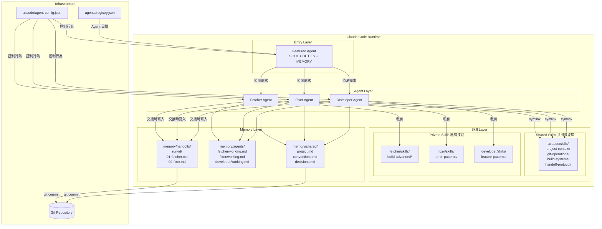
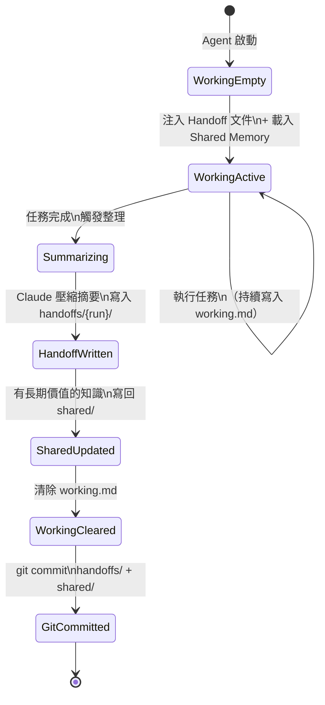
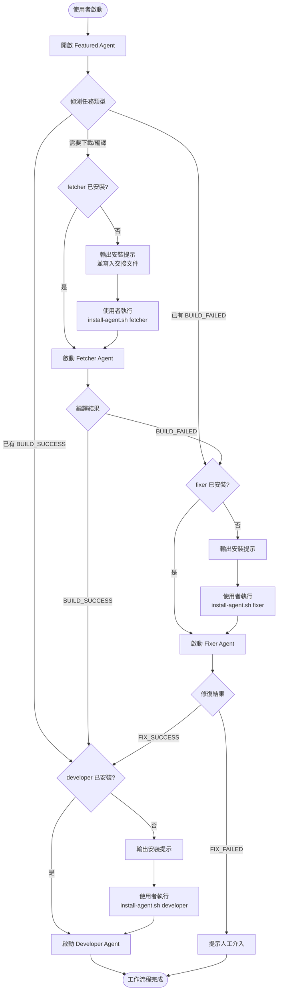
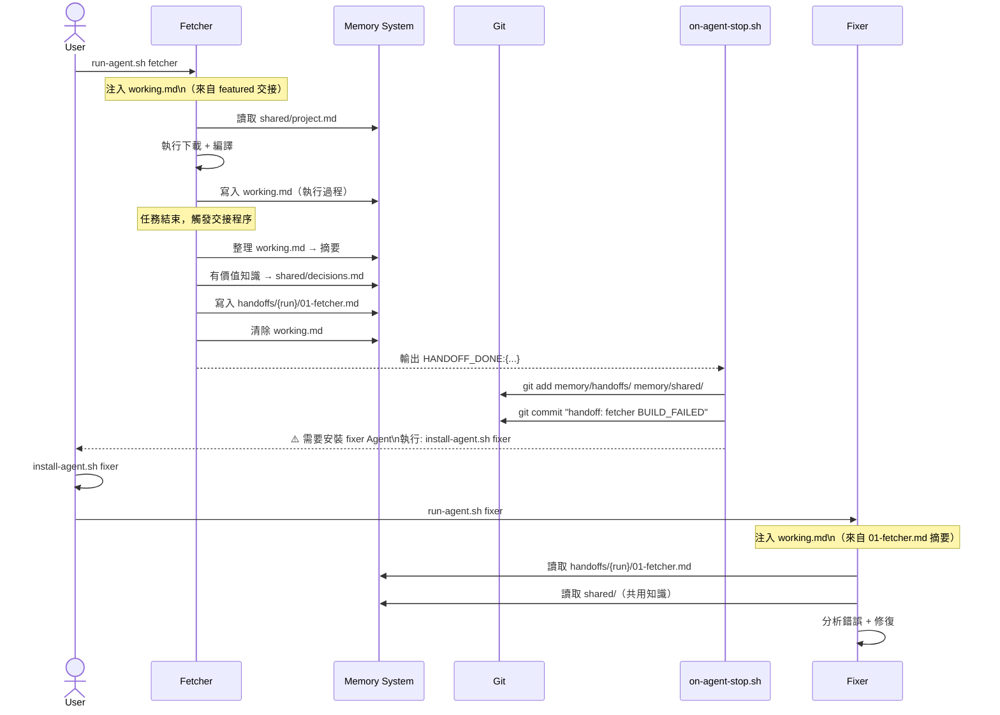
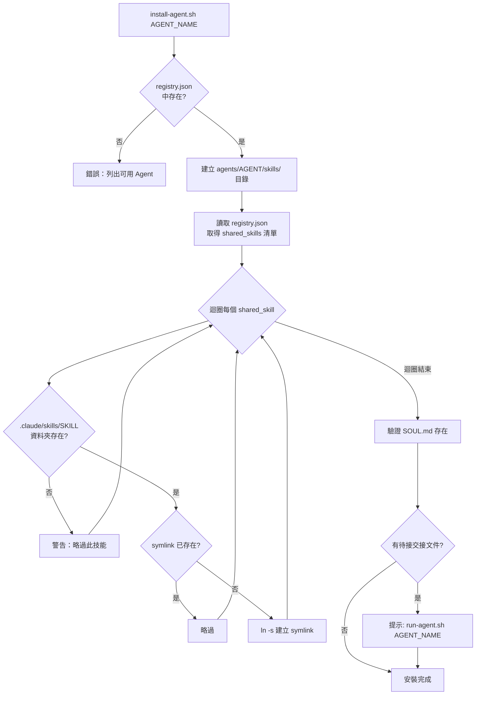
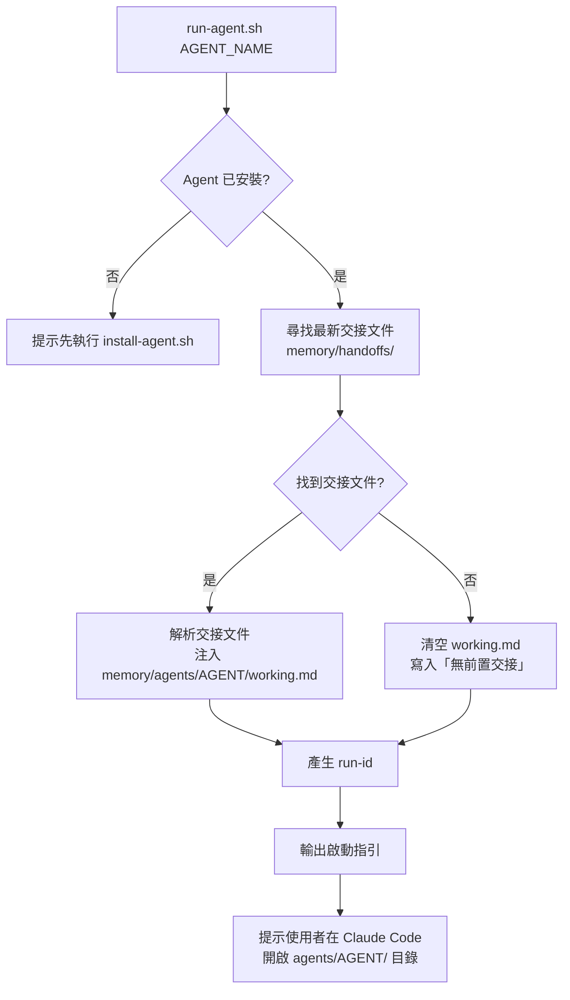
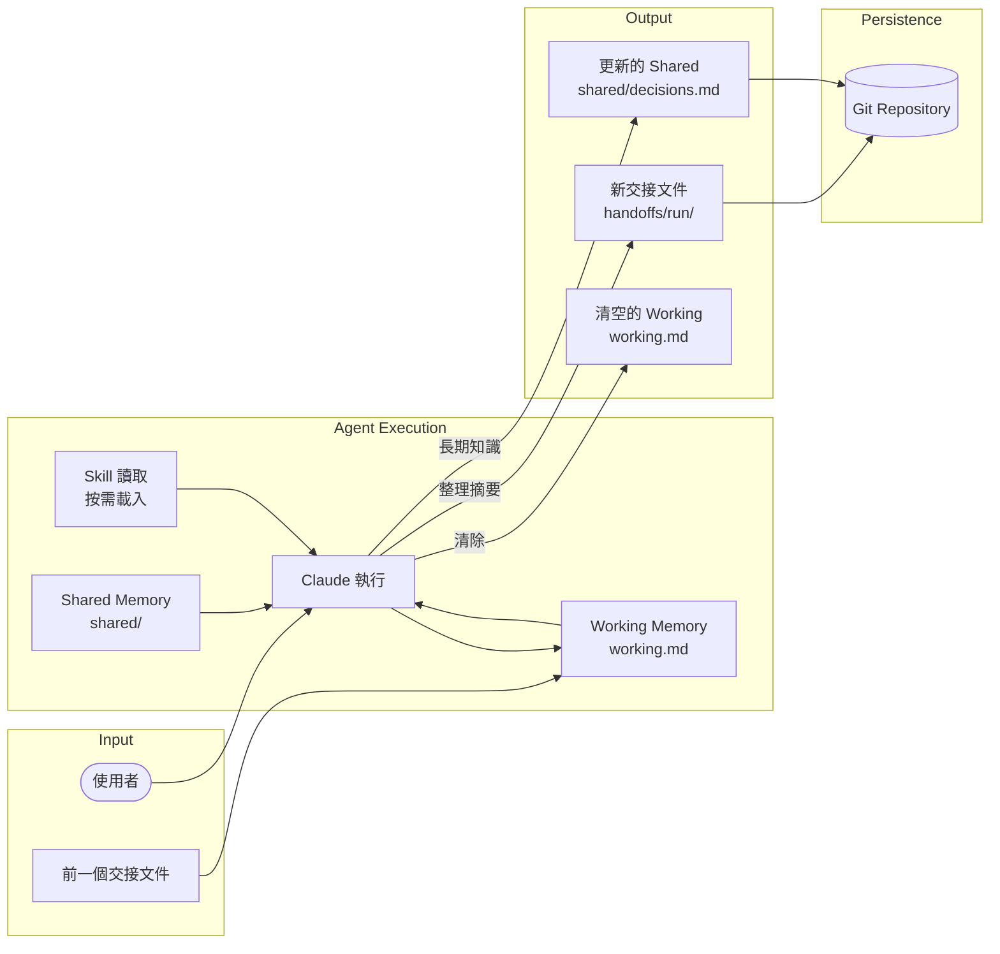
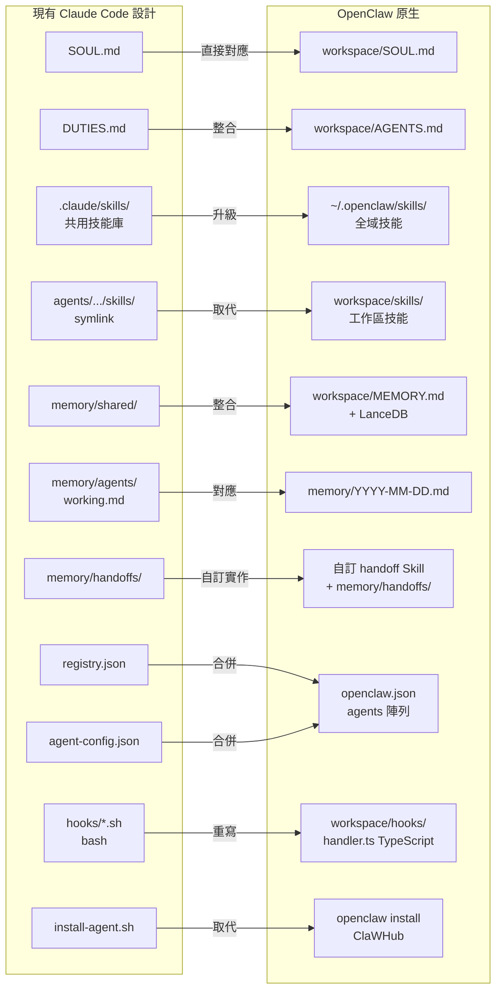
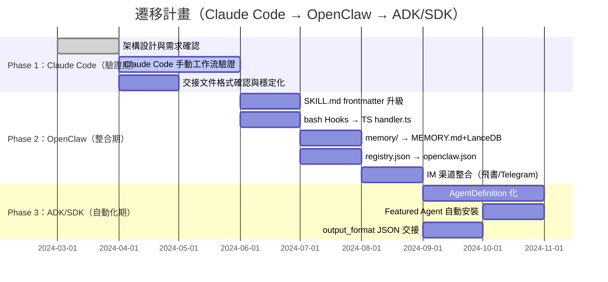

# Multi-Agent Workflow System — 設計書

**文件版本**：v1.1
**狀態**：Draft
**依據**：agents-requirements.md v1.1

---

## 1. 系統架構總覽



---

## 2. 目錄結構設計

```
project-root/
│
├── CLAUDE.md                          ← 全域背景，@引用共用技能
│
├── .claude/
│   ├── settings.json                  ← Hooks 設定
│   ├── agent-config.json              ← 使用者行為設定
│   └── skills/                        ← 共用技能庫（真實檔案）
│       ├── project-context/
│       │   └── SKILL.md
│       ├── git-operations/
│       │   └── SKILL.md
│       ├── build-systems/
│       │   └── SKILL.md
│       ├── code-reading/
│       │   └── SKILL.md
│       └── handoff-protocol/
│           └── SKILL.md
│
├── agents/
│   ├── registry.json                  ← Agent 目錄與安裝資訊
│   │
│   ├── featured/                      ← 必裝，入口 Agent
│   │   ├── CLAUDE.md                  ← 按需載入 featured 技能
│   │   ├── SOUL.md                    ← 身份定義
│   │   ├── DUTIES.md                  ← 職責與交接程序
│   │   └── skills/
│   │       ├── project-context  ──symlink──► .claude/skills/project-context/
│   │       ├── git-operations   ──symlink──► .claude/skills/git-operations/
│   │       ├── handoff-protocol ──symlink──► .claude/skills/handoff-protocol/
│   │       └── agent-discovery/       ← featured 私有技能
│   │           └── SKILL.md
│   │
│   ├── fetcher/                       ← 選裝
│   │   ├── CLAUDE.md
│   │   ├── SOUL.md
│   │   ├── DUTIES.md
│   │   └── skills/
│   │       ├── project-context  ──symlink──►
│   │       ├── git-operations   ──symlink──►
│   │       ├── build-systems    ──symlink──►
│   │       ├── handoff-protocol ──symlink──►
│   │       └── build-advanced/        ← fetcher 私有技能
│   │           └── SKILL.md
│   │
│   ├── fixer/                         ← 選裝
│   │   ├── CLAUDE.md
│   │   ├── SOUL.md
│   │   ├── DUTIES.md
│   │   └── skills/
│   │       ├── project-context  ──symlink──►
│   │       ├── code-reading     ──symlink──►
│   │       ├── handoff-protocol ──symlink──►
│   │       └── error-patterns/
│   │           └── SKILL.md
│   │
│   └── developer/                     ← 選裝
│       ├── CLAUDE.md
│       ├── SOUL.md
│       ├── DUTIES.md
│       └── skills/
│           ├── project-context  ──symlink──►
│           ├── code-reading     ──symlink──►
│           ├── handoff-protocol ──symlink──►
│           └── feature-patterns/
│               └── SKILL.md
│
├── memory/
│   ├── shared/                        ← 所有 Agent 共用，Git 追蹤
│   │   ├── project.md
│   │   ├── conventions.md
│   │   └── decisions.md
│   ├── agents/
│   │   ├── featured/working.md        ← 各 Agent 工作記憶（交接後清除）
│   │   ├── fetcher/working.md
│   │   ├── fixer/working.md
│   │   └── developer/working.md
│   └── handoffs/                      ← 壓縮交接摘要，Git 追蹤
│       └── {run-id}/
│           ├── 01-fetcher.md
│           ├── 02-fixer.md
│           └── 03-developer.md
│
└── scripts/
    ├── install.sh                     ← 初始化整個架構
    ├── install-agent.sh               ← 安裝指定 Agent + 建立 symlink
    ├── run-agent.sh                   ← 啟動 Agent（注入交接文件）
    └── hooks/
        ├── on-agent-stop.sh           ← 觸發：記憶整理 + git commit
        └── on-write.sh                ← 觸發：handoff 檔案自動 commit
```

---

## 3. Skill 系統設計

### 3.1 Skill 資料夾格式

每個 Skill 是一個**獨立資料夾**，內含標準化的 `SKILL.md`：

```
skill-name/
└── SKILL.md        ← YAML frontmatter + Markdown 內容
```

**SKILL.md 格式規範**：

```yaml
---
name: project-context          # 唯一識別名稱
description: 專案背景知識       # 簡短說明
version: 1.0
tags:
  - shared                     # shared = 共用技能
  - required                   # required = 所有 Agent 必載
scope: all                     # all / fetcher / fixer / developer
---

# （技能內容 Markdown）
```

### 3.2 技能繼承關係

```mermaid
graph TD
    subgraph 共用技能庫 .claude/skills/
        PC[project-context]
        GO[git-operations]
        BS[build-systems]
        CR[code-reading]
        HP[handoff-protocol]
    end

    subgraph featured/skills/
        F_PC[project-context] -.symlink.-> PC
        F_GO[git-operations]  -.symlink.-> GO
        F_HP[handoff-protocol]-.symlink.-> HP
        F_AD[agent-discovery 私有]
    end

    subgraph fetcher/skills/
        FT_PC[project-context]-.symlink.-> PC
        FT_GO[git-operations] -.symlink.-> GO
        FT_BS[build-systems]  -.symlink.-> BS
        FT_HP[handoff-protocol]-.symlink.->HP
        FT_BA[build-advanced 私有]
    end

    subgraph fixer/skills/
        FX_PC[project-context]-.symlink.-> PC
        FX_CR[code-reading]   -.symlink.-> CR
        FX_HP[handoff-protocol]-.symlink.->HP
        FX_EP[error-patterns 私有]
    end

    subgraph developer/skills/
        DV_PC[project-context]-.symlink.-> PC
        DV_CR[code-reading]   -.symlink.-> CR
        DV_HP[handoff-protocol]-.symlink.->HP
        DV_FP[feature-patterns 私有]
    end
```



### 3.3 按需載入機制

Claude Code 讀取 CLAUDE.md 時採**層級繼承**：

```
執行環境：agents/fetcher/
  ↓ Claude Code 讀取順序
  agents/fetcher/CLAUDE.md    ← 載入 fetcher 私有技能
        ↑ 自動繼承
  CLAUDE.md（根目錄）          ← @引用 .claude/skills/ 共用技能
```

**根目錄 `CLAUDE.md`（共用技能入口）**：

```markdown
# 全域背景

@.claude/skills/project-context/SKILL.md
@.claude/skills/git-operations/SKILL.md
@.claude/skills/handoff-protocol/SKILL.md
```

**`agents/fetcher/CLAUDE.md`（按需追加）**：

```markdown
# Fetcher 額外技能

@../../.claude/skills/build-systems/SKILL.md
@skills/build-advanced/SKILL.md
@../../memory/shared/project.md
```

---

## 4. 三區記憶架構

### 4.1 記憶區域定義

```
┌──────────────────────────────────────────────────────┐
│  ZONE 1：Shared Memory   memory/shared/               │
│  ┌────────────────────────────────────────────────┐  │
│  │  project.md     專案技術背景與架構               │  │
│  │  conventions.md 程式碼規範、命名慣例             │  │
│  │  decisions.md   跨 Agent 的重要決定              │  │
│  └────────────────────────────────────────────────┘  │
│  特性：所有 Agent 可讀寫 ｜ Git 追蹤 ｜ 永久保存    │
├──────────────────────────────────────────────────────┤
│  ZONE 2：Working Memory  memory/agents/{name}/        │
│  ┌────────────────────────────────────────────────┐  │
│  │  working.md     執行中的暫存思路與中間結果       │  │
│  └────────────────────────────────────────────────┘  │
│  特性：Agent 私有 ｜ 交接後清除 ｜ 可設定是否封存  │
├──────────────────────────────────────────────────────┤
│  ZONE 3：Handoff Memory  memory/handoffs/{run-id}/    │
│  ┌────────────────────────────────────────────────┐  │
│  │  01-fetcher.md  Claude 整理後的精華摘要（< 2K） │  │
│  │  02-fixer.md    下一個 Agent 的「收件匣」        │  │
│  └────────────────────────────────────────────────┘  │
│  特性：唯讀（寫後不修改） ｜ Git 追蹤 ｜ 可統計   │
└──────────────────────────────────────────────────────┘
```

### 4.2 記憶生命週期



---

## 5. 工作流程設計

### 5.1 主流程



### 5.2 交接時序圖



---

## 6. 元件設計

### 6.1 registry.json

```json
{
  "schema_version": "1",
  "agents": {
    "featured": {
      "bundled": true,
      "description": "入口代理，任務偵測與安裝引導",
      "shared_skills": ["project-context", "git-operations", "handoff-protocol"],
      "private_skills": ["agent-discovery"]
    },
    "fetcher": {
      "bundled": false,
      "description": "下載專案並執行編譯",
      "install_cmd": "./scripts/install-agent.sh fetcher",
      "triggers": ["clone", "download", "build", "compile", "編譯"],
      "shared_skills": ["project-context", "git-operations", "build-systems", "handoff-protocol"],
      "private_skills": ["build-advanced"],
      "transitions": {
        "BUILD_SUCCESS": "developer",
        "BUILD_FAILED": "fixer"
      }
    },
    "fixer": {
      "bundled": false,
      "description": "分析並修復編譯錯誤",
      "install_cmd": "./scripts/install-agent.sh fixer",
      "triggers": ["BUILD_FAILED", "error", "fix", "修復"],
      "shared_skills": ["project-context", "code-reading", "handoff-protocol"],
      "private_skills": ["error-patterns"],
      "transitions": {
        "FIX_SUCCESS": "developer",
        "FIX_FAILED": null
      }
    },
    "developer": {
      "bundled": false,
      "description": "在成功編譯的專案上新增功能",
      "install_cmd": "./scripts/install-agent.sh developer",
      "triggers": ["BUILD_SUCCESS", "FIX_SUCCESS", "feature", "新增功能"],
      "shared_skills": ["project-context", "code-reading", "handoff-protocol"],
      "private_skills": ["feature-patterns"],
      "transitions": {}
    }
  }
}
```

### 6.2 agent-config.json

```json
{
  "_doc": "修改此檔案調整系統行為，所有值均有預設",

  "memory": {
    "shared_zone_enabled": true,
    "auto_summarize_before_handoff": true,
    "summarize_max_tokens": 2000,
    "clear_working_memory_after_handoff": true,
    "archive_before_clear": false,
    "archive_path": "memory/archive/"
  },

  "skills": {
    "shared_path": ".claude/skills",
    "on_demand": true,
    "always_load": ["project-context", "handoff-protocol"]
  },

  "handoff": {
    "agent_install_mode": "manual",
    "auto_git_commit": true,
    "git_remote": "origin",
    "git_branch": "main",
    "notify_user_on_missing_agent": true
  },

  "hooks": {
    "on_agent_stop": {
      "enabled": true,
      "summarize_memory": true,
      "git_commit_handoff": true
    },
    "on_write": {
      "enabled": true,
      "auto_commit_handoffs": true
    }
  }
}
```

### 6.3 交接文件格式（Handoff Document）

```markdown
---
schema: handoff-v1
run_id: "20240320-143022"
sequence: 1
from: fetcher
to: fixer
status: BUILD_FAILED
timestamp: "2024-03-20T14:30:22Z"
metrics:
  duration_seconds: 45
  tokens_estimated: 8500
memory_cleared: true
---

## 任務摘要
（3句話內）下載 my-project 並嘗試編譯，在 src/main.c:42
發現型別不匹配錯誤（int vs char*），編譯失敗。

## 關鍵發現
- 專案使用 GNU Make，進入點為 `make all`
- 錯誤位置：`src/main.c` 第 42 行
- 錯誤訊息：`incompatible pointer types passing 'char *' to parameter of type 'int'`
- 相關函式：`process_input(int flags)`

## 建議下一步
1. 將 `src/main.c:42` 的 `char *input` 改為 `int flags`
2. 重新執行 `make all` 驗證
3. 若有其他相依錯誤，繼續修復

## 上下文資料
- project_path: /tmp/my-project
- build_command: make all
- error_file: src/main.c
- shared_memory_updated: true
```

---

## 7. Hook 設計

### 7.1 Hook 事件對應

| 事件 | 觸發時機 | 對應 Script | 行為 |
|------|----------|-------------|------|
| `SubagentStop` | Agent 執行結束 | `on-agent-stop.sh` | 整理記憶、git commit、提示使用者 |
| `PostToolUse[Write]` | 寫入任何檔案 | `on-write.sh` | 若寫入 handoffs/ 則自動 git commit |
| `SessionStart` | Claude Code 啟動 | （預留）| 未來：自動注入交接文件 |

### 7.2 settings.json

```json
{
  "hooks": {
    "SubagentStop": [
      {
        "matcher": ".*",
        "hooks": [{
          "type": "command",
          "command": "bash scripts/hooks/on-agent-stop.sh"
        }]
      }
    ],
    "PostToolUse": [
      {
        "matcher": "Write",
        "hooks": [{
          "type": "command",
          "command": "bash scripts/hooks/on-write.sh"
        }]
      }
    ]
  },
  "permissions": {
    "allow": [
      "Bash(git:*)",
      "Bash(bash scripts/*)"
    ]
  }
}
```

---

## 8. 安裝腳本設計

### 8.1 install-agent.sh 流程



### 8.2 run-agent.sh 流程



---

## 9. 資料流設計



---

## 10. 遷移至 OpenClaw

### 10.1 OpenClaw 目錄結構對應

```
~/.openclaw/
├── openclaw.json                    ← 取代 registry.json + agent-config.json
├── workspace/                       ← 預設工作區（對應現有 project-root/）
│   ├── SOUL.md                      ← 直接對應，格式相容
│   ├── IDENTITY.md                  ← 新增：Agent 對外公開的身份卡
│   ├── AGENTS.md                    ← 取代 DUTIES.md（規則 + 交接程序寫在此）
│   ├── USER.md                      ← 新增：使用者偏好設定
│   ├── TOOLS.md                     ← 新增：本地工具設定（SSH、相機、語音）
│   ├── HEARTBEAT.md                 ← 新增：排程任務定義
│   ├── MEMORY.md                    ← 取代 memory/shared/（長期記憶）
│   ├── memory/
│   │   ├── YYYY-MM-DD.md            ← 取代 memory/agents/{name}/working.md
│   │   └── lancedb/                 ← 新增：向量搜尋索引（混合檢索）
│   ├── skills/                      ← 工作區層技能（取代 agents/{name}/skills/）
│   │   ├── project-context/SKILL.md ← 直接遷移，frontmatter 加 openclaw metadata
│   │   ├── git-operations/SKILL.md
│   │   ├── build-systems/SKILL.md
│   │   ├── handoff-protocol/SKILL.md
│   │   └── {agent-private}/SKILL.md ← 私有技能直接放工作區
│   └── hooks/
│       └── handoff-commit/          ← 取代 scripts/hooks/on-agent-stop.sh
│           ├── HOOK.md
│           └── handler.ts           ← TypeScript，取代 bash script
│
├── skills/                          ← 全域技能（取代 .claude/skills/）
│   └── {skill-name}/SKILL.md        ← 所有 workspace 共用，symlink 不再需要
│
└── agents/
    └── {agent-id}/sessions/         ← Session 儲存
```

### 10.2 元件對應關係



### 10.3 SKILL.md 格式遷移

**現有格式（Claude Code）**：
```yaml
---
name: project-context
description: 專案背景知識
version: 1.0
tags: [shared, required]
scope: all
---
```

**遷移後格式（OpenClaw 相容）**：
```yaml
---
name: project-context
description: "專案背景知識，包含架構決策與技術選型。適用於所有 Agent 啟動時。"
version: "1.0.0"
metadata: {
  "openclaw": {
    "emoji": "📚",
    "always": true,
    "requires": {
      "config": ["memory/shared/project.md"]
    },
    "user-invocable": false
  }
}
---
# 內容（與現有相同，無需修改）
```

> **注意**：只需在 frontmatter 加入 `metadata.openclaw` 區塊，內容本身完全相容。

### 10.4 Hook 遷移：bash → TypeScript

**現有（`scripts/hooks/on-agent-stop.sh`）**：
```bash
#!/bin/bash
git add memory/handoffs/ memory/shared/
git commit -m "handoff: $(date)"
```

**遷移後（`workspace/hooks/handoff-commit/handler.ts`）**：
```typescript
import type { HookHandler } from "@openclaw/sdk";
import { execSync } from "child_process";

// HOOK.md 中宣告事件：session:end
const handler: HookHandler = async (ctx, event) => {
  const { workspacePath, agentId } = ctx;
  const handoffDir = `${workspacePath}/memory/handoffs`;

  // 1. git commit 交接文件與共用記憶
  execSync(`git -C ${workspacePath} add memory/handoffs/ MEMORY.md`);
  execSync(
    `git -C ${workspacePath} commit -m "handoff: ${agentId} ${event.data?.status ?? 'completed'} at ${new Date().toISOString()}"`,
    { stdio: "pipe" }
  );

  // 2. 透過 Gateway RPC 通知使用者
  await ctx.rpc("chat.send", {
    message: `✅ ${agentId} 交接完成，交接文件已 commit。`,
  });

  return { success: true };
};

export default handler;
```

### 10.5 交接（Handoff）機制 OpenClaw 實作

OpenClaw 本身無原生交接機制，以 **自訂 Skill + 工作區記憶** 實作：

```
workspace/
├── skills/
│   └── handoff-protocol/
│       └── SKILL.md          ← 交接規範（與現有格式相同）
├── memory/
│   └── handoffs/             ← 保留現有交接文件目錄
│       └── {run-id}/
│           └── 01-fetcher.md
└── hooks/
    ├── handoff-commit/       ← session:end 時 git commit
    │   ├── HOOK.md
    │   └── handler.ts
    └── handoff-inject/       ← session:start 時注入前次交接文件
        ├── HOOK.md
        └── handler.ts        ← 讀取最新 handoffs/ 寫入今日 daily log
```

**`handoff-inject/handler.ts`（session:start 注入）**：
```typescript
import type { HookHandler } from "@openclaw/sdk";
import { readFileSync, readdirSync } from "fs";
import { join } from "path";

const handler: HookHandler = async (ctx) => {
  const handoffsDir = join(ctx.workspacePath, "memory", "handoffs");

  // 找最新交接文件
  const runs = readdirSync(handoffsDir).sort().reverse();
  if (!runs.length) return {};

  const latestRun = runs[0];
  const files = readdirSync(join(handoffsDir, latestRun)).sort().reverse();
  if (!files.length) return {};

  const handoff = readFileSync(
    join(handoffsDir, latestRun, files[0]),
    "utf-8"
  );

  // 注入到今日 daily log 的開頭
  const today = new Date().toISOString().split("T")[0];
  const dailyPath = join(ctx.workspacePath, "memory", `${today}.md`);
  const existing = existsSync(dailyPath) ? readFileSync(dailyPath, "utf-8") : "";

  writeFileSync(
    dailyPath,
    `## 交接文件注入（${latestRun}）\n\n${handoff}\n\n---\n\n${existing}`
  );

  return {};
};
export default handler;
```

### 10.6 openclaw.json 設計（取代 registry.json + agent-config.json）

```json5
{
  // Agent 設定（取代 registry.json）
  "agents": [
    {
      "id": "featured",
      "name": "Featured Agent",
      "description": "入口代理，任務偵測與 Agent 引導",
      "workspace": "~/.openclaw/workspace/featured",
      "model": { "primary": "anthropic/claude-opus-4-6" },
      "permissions": { "allowedCommands": ["read", "write", "bash", "edit"] }
    },
    {
      "id": "fetcher",
      "name": "Fetcher Agent",
      "description": "下載專案並執行編譯",
      "workspace": "~/.openclaw/workspace/fetcher",
      "model": { "primary": "anthropic/claude-opus-4-6" },
      "permissions": { "allowedCommands": ["read", "write", "bash", "edit"] }
    },
    {
      "id": "fixer",
      "name": "Fixer Agent",
      "description": "分析並修復編譯錯誤",
      "workspace": "~/.openclaw/workspace/fixer",
      "model": { "primary": "anthropic/claude-opus-4-6" }
    },
    {
      "id": "developer",
      "name": "Developer Agent",
      "description": "在成功編譯的專案上新增功能",
      "workspace": "~/.openclaw/workspace/developer",
      "model": { "primary": "anthropic/claude-opus-4-6" }
    }
  ],

  // 技能載入設定（取代 agent-config.json skills 區塊）
  "skills": {
    "load": {
      "watch": true,
      "watchDebounceMs": 250,
      "extraDirs": ["~/.openclaw/workspace/shared-skills"]
    }
  },

  // 記憶設定（取代 agent-config.json memory 區塊）
  "memory": {
    "provider": "lancedb",
    "path": "~/.openclaw/workspace/memory/lancedb"
  },

  // Hooks 設定
  "hooks": {
    "internal": {
      "entries": {
        "boot-md": {},
        "session-memory": {},
        "handoff-inject": { "enabled": true },
        "handoff-commit": { "enabled": true }
      }
    }
  }
}
```

### 10.7 遷移時序



---

## 11. 未來遷移路徑（OpenClaw → ADK/SDK）

### 11.1 元件對應

| OpenClaw 元件 | ADK/SDK 對應 |
|--------------|-------------|
| `workspace/SOUL.md` + `AGENTS.md` | `AgentDefinition(description=..., prompt=...)` |
| `~/.openclaw/skills/` | `system_prompt` 中的知識注入 |
| `memory/handoffs/*.md` | 結構化 `output_format` JSON schema |
| `hooks/handler.ts` | `PostToolUse` callback |
| `openclaw.json` agents[] | `ClaudeAgentOptions` 參數 |
| Gateway WebSocket | `ClaudeSDKClient` 長連接 |
| 多渠道（IM）觸發 | `query()` API 呼叫 |

---

## 12. 設計決策紀錄（ADR）

| # | 決策 | 原因 | 取捨 |
|---|------|------|------|
| ADR-01 | Skill 以資料夾格式儲存（非單一檔案） | 與 OpenClaw SKILL.md 格式完全相容，未來可擴充 | 略增目錄複雜度 |
| ADR-02 | Skill 共用以 symlink 實作（Phase 1） | 避免複製；Phase 2 遷移後由 OpenClaw 全域層取代 | Windows 不支援（本期限制） |
| ADR-03 | 工作記憶交接後清除 | 避免 Context 爆炸；OpenClaw daily log 機制自然支援 | 需要完善摘要機制 |
| ADR-04 | 交接文件採 Markdown + YAML frontmatter | 人可讀、Git diff 友好；與 OpenClaw SKILL.md 格式一致 | 不如純 JSON 嚴格 |
| ADR-05 | run-id 採 timestamp | 簡單、不依賴外部服務；OpenClaw session ID 可作替代 | 極低機率衝突 |
| ADR-06 | Agent 安裝預設手動 | 本期驗證安全性；Phase 2 改用 `openclaw install` | 需使用者額外操作 |
| ADR-07 | SOUL.md 格式優先對齊 OpenClaw | 降低 Phase 2 遷移成本，Claude Code 與 OpenClaw 均可直接使用 | OpenClaw 特有欄位在 Claude Code 期間為空 |
| ADR-08 | 交接機制在 OpenClaw 以自訂 Skill + Hook 實作 | OpenClaw 無原生交接概念，但 Hook 系統足以模擬 | 需維護 2 個 Hook（inject + commit） |
| ADR-09 | hooks 從 bash 設計為可轉 TypeScript | Phase 2 直接重寫為 handler.ts，邏輯不變只換語言 | 需學習 OpenClaw Hook SDK |
