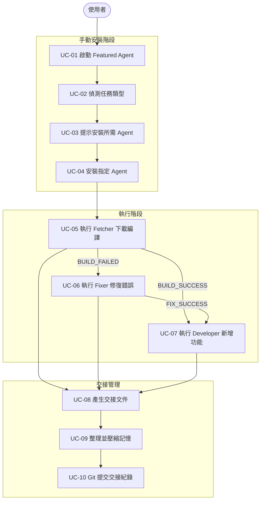
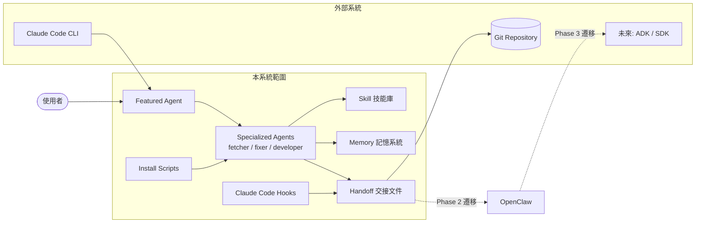
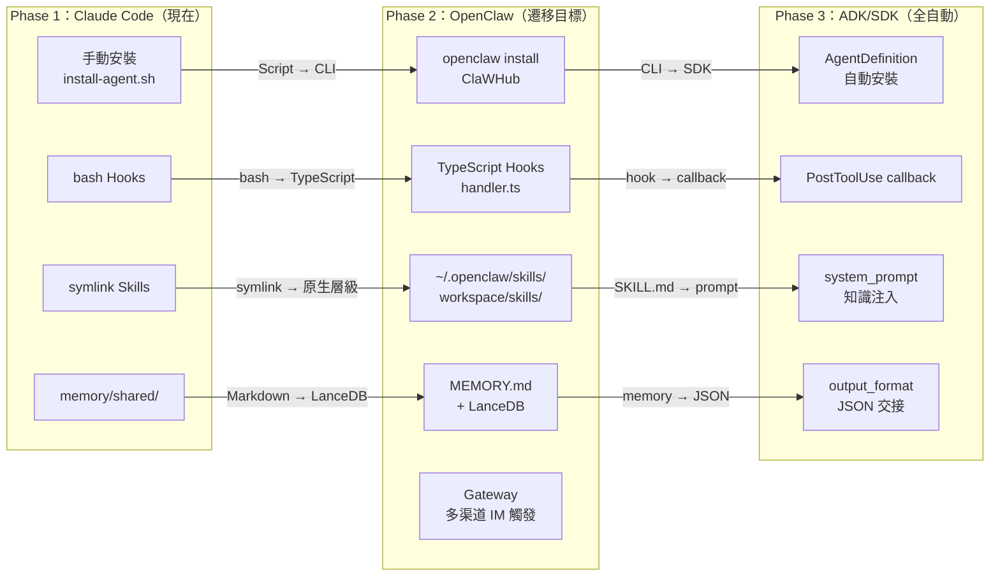

# Multi-Agent Workflow System — 需求書

**文件版本**：v1.1
**狀態**：Draft
**目標讀者**：架構師、開發者、產品負責人

---

## 1. 背景與目標

### 1.1 問題陳述

使用者在處理「下載專案 → 編譯 → 修復錯誤 → 新增功能」這類多步驟工作流程時，目前完全依賴人工判斷：

- 何時需要切換到不同的 AI 代理（Agent）
- 如何在代理之間傳遞上下文
- 如何避免因長對話導致的 Context 爆炸

### 1.2 目標

以 Claude Code 為執行環境，設計一套**可擴充的多代理協作系統**，達成：

1. 入口代理（Featured Agent）自動偵測任務需求，提示使用者安裝對應專門代理
2. 代理之間透過結構化交接文件傳遞上下文，避免 Context 爆炸
3. 技能（Skill）可跨代理共用，避免重複定義
4. 交接紀錄透過 Git 保存，支援後台統計與稽核
5. 未來可平滑遷移至 OpenClaw，充分利用其 Gateway、Skills、Hooks 原生能力
6. OpenClaw 之後可再遷移至 ADK / SDK 實現全自動化

---

## 2. 利害關係人

| 角色 | 關注點 |
|------|--------|
| 終端使用者 | 簡單易用，不需理解內部架構 |
| 開發者 | 易於新增 Agent / Skill，文件清楚 |
| 架構師 | 模組化、可擴充、未來遷移成本低 |
| 維運人員 | 交接紀錄可查、錯誤可溯源 |

---

## 3. 使用案例總覽

---

## 4. 功能需求

### FR-01：入口代理（Featured Agent）

| 編號 | 需求 | 優先級 |
|------|------|--------|
| FR-01-1 | 系統預設安裝 Featured Agent，無需額外操作 | Must |
| FR-01-2 | Featured Agent 能辨識任務類型（下載/編譯/修復/開發） | Must |
| FR-01-3 | 若所需 Agent 未安裝，輸出明確的安裝指令提示 | Must |
| FR-01-4 | 提示前先將目前上下文寫入交接文件，確保不遺失 | Must |
| FR-01-5 | 安裝提示應包含安裝指令與後續執行指令 | Should |

### FR-02：Agent 安裝機制

| 編號 | 需求 | 優先級 |
|------|------|--------|
| FR-02-1 | 提供 `install-agent.sh` 腳本，支援單行安裝 | Must |
| FR-02-2 | 安裝時自動建立 Skill symlink（指向共用技能庫） | Must |
| FR-02-3 | 安裝後提示是否有待接收的交接文件 | Should |
| FR-02-4 | 支援透過 `registry.json` 管理可用 Agent 清單 | Must |
| FR-02-5 | 安裝模式預設為手動（`agent_install_mode: manual`），未來支援自動 | Must |

### FR-03：技能共用（Skill Sharing）

| 編號 | 需求 | 優先級 |
|------|------|--------|
| FR-03-1 | 共用技能存放於 `.claude/skills/`，每個技能為獨立資料夾 | Must |
| FR-03-2 | 每個技能資料夾內含 `SKILL.md`（YAML frontmatter + 內容） | Must |
| FR-03-3 | Agent 的 `skills/` 目錄透過 symlink 引用共用技能，不複製 | Must |
| FR-03-4 | Agent 可擁有私有技能（不 symlink，直接放在自己的 skills/ 下） | Must |
| FR-03-5 | 新增共用技能後，重跑 `install-agent.sh` 可更新 symlink | Should |

### FR-04：三區記憶架構

| 編號 | 需求 | 優先級 |
|------|------|--------|
| FR-04-1 | 提供共用記憶區（`memory/shared/`），所有 Agent 均可讀寫 | Must |
| FR-04-2 | 每個 Agent 擁有獨立工作記憶（`memory/agents/{name}/working.md`） | Must |
| FR-04-3 | 交接前 Claude 自動整理工作記憶，產生壓縮摘要（< 2000 tokens） | Must |
| FR-04-4 | 交接完成後清除工作記憶（可設定是否封存原始內容） | Must |
| FR-04-5 | 有長期價值的發現自動寫回共用記憶區 | Should |

### FR-05：交接協議（Handoff Protocol）

| 編號 | 需求 | 優先級 |
|------|------|--------|
| FR-05-1 | 交接文件格式統一（YAML frontmatter + Markdown 內容） | Must |
| FR-05-2 | 交接文件依 `run-id` 組織，支援多次執行並行 | Must |
| FR-05-3 | Agent 結束前最後一行輸出機器可讀的 `HANDOFF_DONE:{}` JSON | Must |
| FR-05-4 | Hook 解析 `HANDOFF_DONE` 後自動 git commit 交接文件 | Should |
| FR-05-5 | 交接文件含 metrics（執行時間、token 使用量） | Could |

### FR-06：Git 整合

| 編號 | 需求 | 優先級 |
|------|------|--------|
| FR-06-1 | `handoffs/` 與 `memory/shared/` 納入 Git 追蹤 | Must |
| FR-06-2 | 每次交接自動產生 Git commit，訊息包含 run-id 與狀態 | Should |
| FR-06-3 | 支援推送到遠端（`git push`），供後台統計 | Could |
| FR-06-4 | 所有交接紀錄可用 `git log` 查詢歷史 | Must |

### FR-07：可設定行為

| 編號 | 需求 | 優先級 |
|------|------|--------|
| FR-07-1 | 提供 `.claude/agent-config.json` 統一管理所有行為設定 | Must |
| FR-07-2 | 記憶整理（summarize）可開關 | Must |
| FR-07-3 | Git 自動提交可開關 | Must |
| FR-07-4 | 工作記憶清除後是否封存可設定 | Must |
| FR-07-5 | Agent 安裝模式（manual / auto）可設定 | Must |

---

## 5. 非功能需求

| 類別 | 需求 |
|------|------|
| **可擴充性** | 新增 Agent 或 Skill 不需修改現有代碼，只需新增資料夾 |
| **可維護性** | 所有設定集中於 `agent-config.json`，無硬編碼行為 |
| **可遷移性** | 交接文件格式與 ADK/SDK 兼容，未來自動化遷移成本低 |
| **可稽核性** | 所有交接紀錄保存於 Git，支援 diff 與 blame |
| **Context 效率** | 交接摘要不超過 2000 tokens，避免 Context 爆炸 |
| **相容性** | 完全運行於 Claude Code CLI，不依賴外部服務 |

---

## 6. 限制與假設

### 限制

- 本期為**手動安裝模式**，由使用者執行 `install-agent.sh` 安裝所需 Agent
- 記憶整理由 Claude 自行判斷，不保證 100% 精確
- Symlink 在 Windows 環境需要額外處理（本期不支援）

### 假設

- 使用者具備基本的終端機操作能力
- 執行環境已安裝 Claude Code CLI 與 Git
- `bash` 環境可用

---

## 7. 系統邊界

---

## 8. 名詞定義

| 術語 | 定義 |
|------|------|
| Featured Agent | 預設安裝的入口代理，負責任務偵測與使用者引導 |
| Specialized Agent | 針對特定任務的專門代理（fetcher / fixer / developer） |
| Skill | 可複用的知識文件，以資料夾 + SKILL.md 格式儲存 |
| Symlink | 符號連結，Agent skills/ 指向共用技能庫，避免複製 |
| Shared Memory | 所有 Agent 共用的知識區（`memory/shared/`） |
| Working Memory | Agent 執行期間的暫存記憶，交接後清除 |
| Handoff Document | 交接時產生的壓縮摘要文件，存於 `memory/handoffs/` |
| run-id | 每次工作流程執行的唯一識別碼（timestamp-based） |
| Context 爆炸 | 對話 token 累積過多導致 Claude 無法有效運作的現象 |
| OpenClaw | 基於 pi-mono 的開源個人 AI 助手，具備 Gateway、Hooks、Skills、Memory 原生能力 |
| pi-mono | OpenClaw 的底層框架，四個核心工具（read/write/edit/bash）的極簡架構 |
| Gateway | OpenClaw 的核心守護進程，提供 WebSocket API 與多渠道（14+）整合 |
| ClaWHub | OpenClaw 的 Skill 與 Hook 市集，類似 npm registry |

---

## 9. 遷移需求（OpenClaw）

### 9.1 遷移目標

將現有 Claude Code 多代理系統遷移至 OpenClaw，利用其原生能力取代自建機制：

| 現有機制（自建） | OpenClaw 原生能力 | 效益 |
|----------------|-----------------|------|
| `.claude/skills/` + symlink | `~/.openclaw/skills/`（全域）+ `workspace/skills/`（工作區） | 無需手動 symlink，平台原生支援 |
| `scripts/hooks/*.sh`（bash） | `workspace/hooks/{name}/handler.ts`（TypeScript） | 類型安全、支援 RPC 回調 |
| `memory/shared/` | `workspace/MEMORY.md` + daily logs + LanceDB | 原生混合向量搜尋（70% Vector + 30% BM25） |
| `agents/registry.json` | `~/.openclaw/openclaw.json` agents 陣列 | 統一設定、原生 CLI 管理 |
| `install-agent.sh` | `openclaw install` / ClaWHub 安裝 | 生態系統整合 |
| `memory/handoffs/`（自建） | 自訂 Skill + `workspace/memory/` | 需設計 OpenClaw-native 交接機制 |

### 9.2 遷移功能需求

| 編號 | 需求 | 優先級 |
|------|------|--------|
| FR-MIG-01 | 現有 SKILL.md 格式須相容 OpenClaw SKILL.md frontmatter 規範 | Must |
| FR-MIG-02 | 現有交接文件（handoff）機制以 OpenClaw Skill 形式重新實作 | Must |
| FR-MIG-03 | bash Hooks 轉換為 TypeScript `handler.ts`，事件對應 OpenClaw event schema | Must |
| FR-MIG-04 | `memory/shared/` 內容可匯入 `workspace/MEMORY.md` 與 LanceDB | Should |
| FR-MIG-05 | 每個 Agent 對應 OpenClaw 的一個 Workspace 設定 | Must |
| FR-MIG-06 | `openclaw.json` 取代 `registry.json` 與 `agent-config.json` | Must |
| FR-MIG-07 | 交接統計資料仍透過 Git 保存，確保稽核性不中斷 | Must |
| FR-MIG-08 | 支援多渠道觸發（如飛書 / Telegram），讓使用者透過 IM 操作工作流 | Could |

### 9.3 遷移三階段

