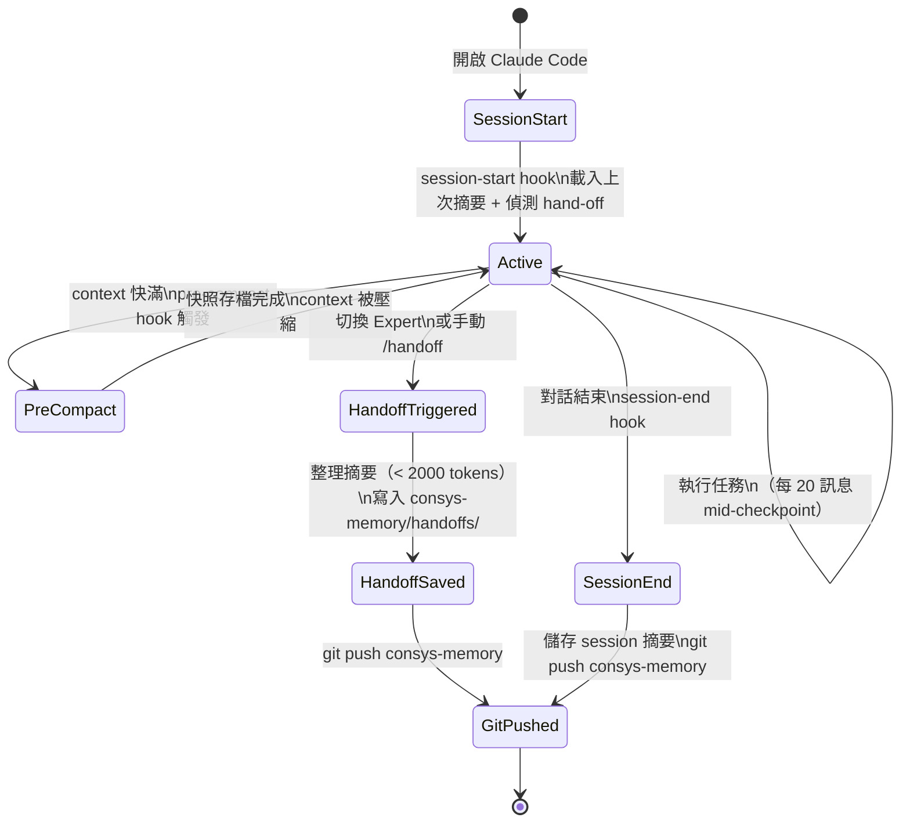
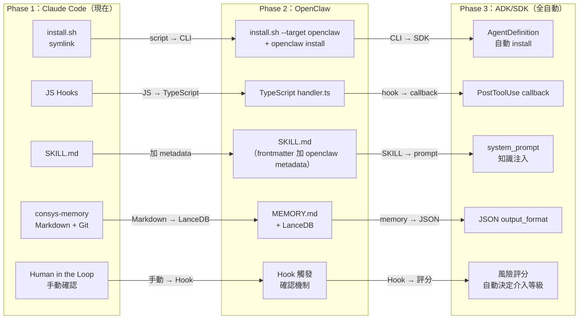

# Consys Experts — 設計書

**文件版本**：v2.1
**狀態**：Draft
**依據**：agents-requirements.md v2.1

---

## 1. 系統架構總覽

### 1.1 Harness 架構觀

本系統依據 **Harness Engineering** 的精神設計（參考：[Birgitta Böckeler / Martin Fowler Blog](https://martinfowler.com/articles/exploring-gen-ai/harness-engineering.html)）。

> Harness = 一套環繞在 AI 模型周圍的系統、工具與實踐，用以約束、引導並強化 AI Agent 的能力。

```
┌─────────────────────────────────────────────────────────────────────┐
│                        Consys Expert Harness                        │
│                                                                     │
│  ┌──────────────────────────────────────────────────────────────┐  │
│  │  上下文工程（Context Engineering）                            │  │
│  │  SKILL.md 知識庫、expert.md、expert.local.md、shared memory  │  │
│  └──────────────────────────────────────────────────────────────┘  │
│  ┌──────────────────────────────────────────────────────────────┐  │
│  │  架構約束（Architectural Constraints）                        │  │
│  │  Hooks（pre-compact、write-guard）、hand-off 格式規範         │  │
│  └──────────────────────────────────────────────────────────────┘  │
│  ┌──────────────────────────────────────────────────────────────┐  │
│  │  垃圾回收（Garbage Collection）                               │  │
│  │  session-end 整理記憶、push consys-memory                    │  │
│  └──────────────────────────────────────────────────────────────┘  │
│                                                                     │
│                 ↓ 透過以上三層，強化 AI 核心能力                    │
│                                                                     │
│  ┌──────────────────────────────────────────────────────────────┐  │
│  │         Claude Code（或未來 OpenClaw / ADK / SDK）            │  │
│  │              Think → Plan → Act → Learn                      │  │
│  └──────────────────────────────────────────────────────────────┘  │
└─────────────────────────────────────────────────────────────────────┘
```

### 1.2 Consys Expert 組成

```
Consys Expert = Agent 核心能力 + Consys Workflow + Consys Tool + Consys Knowledge

┌────────────────┐  ┌────────────────┐  ┌────────────────┐
│   Workflow     │  │     Tool       │  │   Knowledge    │
│  .claude/hooks │  │ .claude/cmds   │  │ .claude/skills │
│                │  │                │  │                │
│ session-start  │  │ /experts       │  │ expert-disc.   │
│ session-end    │  │ /handoff       │  │ handoff-proto  │
│ pre-compact    │  │ /...           │  │ build-systems  │
│ mid-checkpoint │  │                │  │ ...            │
└────────────────┘  └────────────────┘  └────────────────┘
       ↑                   ↑                   ↑
   common/ + Expert 私有（全部透過 symlink 接入 .claude/）
```

### 1.3 整體元件圖

```mermaid
graph TB
    subgraph Workspace
        CLAUDE[CLAUDE.md\n@include expert.md\n@include expert.local.md]

        subgraph .claude/
            EXP_MD[expert.md\n由 install.sh 生成]
            EXP_LOCAL[expert.local.md\n使用者客製化]
            SKILLS[skills/\nsymlinks]
            HOOKS[hooks/\nsymlinks]
            CMDS[commands/\nsymlinks]
            ACTIVE[.active-expert]
        end

        subgraph codespace/
            FW[fw/\n.repo + bora repos]
            DRV[drv/\n.repo + driver repos]
        end
    end

    subgraph consys-experts/
        REGISTRY[registry.json]

        subgraph common/
            C_SKILLS[skills/\nexpert-discovery\nhandoff-protocol]
            C_HOOKS[hooks/\nsession-*.js\npre-compact.js]
            C_CMDS[commands/\nexperts.md\nhandoff.md]
        end

        subgraph experts/
            BE[build-expert/\nexpert.json\nCLAUDE.md\nskills/build-systems]
            CE[cicd-expert/\nexpert.json\nCLAUDE.md\nskills/pipeline-ops]
            DE[device-expert/\nexpert.json\nCLAUDE.md\nskills/device-ctrl]
        end

        subgraph external/
            SC[skill-creator/]
            CME[claude-memory-engine/]
        end
    end

    subgraph consys-memory/
        EMP[employees/\njohn.doe/\n  sessions/\n  handoffs/\n  summary.md]
    end

    GIT[(Git Remote)]

    CLAUDE --> EXP_MD
    CLAUDE --> EXP_LOCAL
    SKILLS -.symlink.-> C_SKILLS
    SKILLS -.symlink.-> BE
    HOOKS -.symlink.-> C_HOOKS
    CMDS -.symlink.-> C_CMDS
    HOOKS -->|session-end push| consys-memory/
    consys-memory/ --> GIT
```

---

## 2. 目錄結構設計

### 2.1 `consys-experts` Repo

```
consys-experts/ (git)
├── README.md
├── registry.json                    ← 所有 Expert 目錄
├── install.sh                       ← 頂層：env vars + clone consys-memory
│
├── common/
│   ├── skills/                      ← Knowledge（共用知識庫）
│   │   ├── expert-discovery/
│   │   │   └── SKILL.md
│   │   └── handoff-protocol/
│   │       └── SKILL.md
│   ├── hooks/                       ← Workflow（自動觸發）
│   │   ├── session-start.js
│   │   ├── session-end.js
│   │   ├── pre-compact.js
│   │   ├── mid-session-checkpoint.js
│   │   └── shared-utils.js
│   └── commands/                    ← Tool（手動指令）
│       ├── experts.md
│       └── handoff.md
│
├── experts/
│   ├── build-expert/
│   │   ├── expert.json
│   │   ├── CLAUDE.md
│   │   ├── install.sh
│   │   └── skills/
│   │       └── build-systems/SKILL.md
│   ├── cicd-expert/
│   │   ├── expert.json
│   │   ├── CLAUDE.md
│   │   ├── install.sh
│   │   └── skills/
│   │       └── pipeline-operations/SKILL.md
│   └── device-expert/
│       ├── expert.json
│       ├── CLAUDE.md
│       ├── install.sh
│       └── skills/
│           └── device-control/SKILL.md
│
└── external/                        ← 社群工具（工具名稱為資料夾名）
    ├── skill-creator/               ← git submodule
    └── claude-memory-engine/        ← git submodule（參考實作）
```

### 2.2 Agent First 場景（完整 workspace）

```
workspace/                                       ← $CONSYS_EXPERTS_WORKSPACE_ROOT_PATH
│
├── consys-experts/ (git)                        ← $CONSYS_EXPERTS_PATH
│   └── （2.1 結構）
│
├── consys-memory/ (git)                         ← $CONSYS_MEMORY_PATH
│   └── employees/
│       └── john.doe/                            ← $CONSYS_EMPLOYEE_ID
│           ├── sessions/
│           │   └── 2026-03-23.md
│           ├── handoffs/
│           │   └── {run-id}.md
│           └── summary.md
│
├── CLAUDE.md                                    ← install.sh 生成
│   # @.claude/expert.md
│   # @.claude/expert.local.md
│
├── .claude/
│   ├── expert.md                                ← 由 expert.json 生成
│   ├── expert.local.md                          ← 個人客製化（.gitignore）
│   ├── .active-expert                           ← "build-expert"
│   │
│   ├── skills/                                  ← Knowledge symlinks
│   │   ├── expert-discovery → $CONSYS_EXPERTS_PATH/common/skills/expert-discovery/
│   │   ├── handoff-protocol → $CONSYS_EXPERTS_PATH/common/skills/handoff-protocol/
│   │   └── build-systems    → $CONSYS_EXPERTS_PATH/experts/build-expert/skills/build-systems/
│   │
│   ├── hooks/                                   ← Workflow symlinks
│   │   ├── session-start.js          → $CONSYS_EXPERTS_PATH/common/hooks/session-start.js
│   │   ├── session-end.js            → $CONSYS_EXPERTS_PATH/common/hooks/session-end.js
│   │   ├── pre-compact.js            → $CONSYS_EXPERTS_PATH/common/hooks/pre-compact.js
│   │   ├── mid-session-checkpoint.js → $CONSYS_EXPERTS_PATH/common/hooks/mid-session-checkpoint.js
│   │   └── shared-utils.js           → $CONSYS_EXPERTS_PATH/common/hooks/shared-utils.js
│   │
│   └── commands/                                ← Tool symlinks
│       ├── experts.md  → $CONSYS_EXPERTS_PATH/common/commands/experts.md
│       └── handoff.md  → $CONSYS_EXPERTS_PATH/common/commands/handoff.md
│
└── codespace/                                   ← $CONSYS_EXPERT_CODE_SPACE_PATH
    ├── fw/
    │   ├── .repo (git)
    │   └── bora/
    │       ├── bt/ (git)
    │       ├── build/ (git)
    │       ├── wifi/ (git)
    │       └── mcu/ (git)
    ├── fw2/
    │   ├── .repo (git)
    │   └── bora/
    │       ├── bt/ (git)
    │       ├── build/ (git)
    │       ├── mcu/ (git)
    │       └── wifi/ (git)
    ├── drv/                                     ← gen4m driver SDK（可能上百個 repo）
    │   ├── .repo (git)
    │   └── gen4m/
    │       ├── wlan_gen4m/ (git)
    │       └── wlan_private/ (git)
    └── drv2/                                    ← logan driver SDK
        ├── .repo (git)
        └── logan/
            ├── wlan_logan/ (git)
            └── wlan_hwifi/ (git)
```

### 2.3 Legacy 場景（完整 workspace）

```
workspace/                           ← $CONSYS_EXPERTS_WORKSPACE_ROOT_PATH
│                                       $CONSYS_EXPERT_CODE_SPACE_PATH（同一路徑）
│
├── .repo (git)                      ← 已存在（傳統 repo tool 下載）
├── bora/
│   ├── wifi/ (git)
│   ├── bt/ (git)
│   ├── mcu/ (git)
│   ├── build/ (git)
│   └── coexistence/ (git)
│
├── consys-experts/ (git)            ← 後續 clone
├── consys-memory/ (git)             ← install.sh 自動 clone
├── CLAUDE.md                        ← install.sh 生成
└── .claude/
    ├── expert.md
    ├── expert.local.md
    ├── .active-expert
    ├── skills/   （同 2.2）
    ├── hooks/    （同 2.2）
    └── commands/ （同 2.2）
```

---

## 3. 環境變數設計

install.sh 透過 `source` 設定以下環境變數，供 Expert 的 workflow（hooks）、tool（commands）、knowledge（skills）使用：

```bash
# install.sh 設定片段（需 source 執行）

# consys-experts repo 路徑
export CONSYS_EXPERTS_PATH="$(cd "$(dirname "${BASH_SOURCE[0]}")/../.." && pwd)"

# workspace 根目錄（.claude/ 所在）
export CONSYS_EXPERTS_WORKSPACE_ROOT_PATH="$(pwd)"

# source code 路徑
# Agent First：workspace/codespace/
# Legacy（自動偵測）：workspace/（同 root）
if [ -f ".repo/manifest.xml" ]; then
    export CONSYS_EXPERT_CODE_SPACE_PATH="$(pwd)"          # legacy
else
    export CONSYS_EXPERT_CODE_SPACE_PATH="$(pwd)/codespace" # agent-first
fi

# 記憶 repo 路徑
export CONSYS_MEMORY_PATH="$(pwd)/consys-memory"

# 員工工號（git username）
export CONSYS_EMPLOYEE_ID="$(git config user.name)"
```

**在 Hook 中使用範例**：
```javascript
// session-end.js
const memoryPath = process.env.CONSYS_MEMORY_PATH;
const employeeId = process.env.CONSYS_EMPLOYEE_ID;
const sessionFile = `${memoryPath}/employees/${employeeId}/sessions/${today}.md`;
```

**在 Skill 中使用範例**：
```markdown
<!-- build-systems/SKILL.md 內容片段 -->
## 編譯路徑
預設 firmware build 目錄為 `$CONSYS_EXPERT_CODE_SPACE_PATH/fw/bora/build`
```

---

## 4. install.sh 設計

### 4.1 參數定義

```bash
source experts/build-expert/install.sh [OPTIONS]

OPTIONS:
  （無參數）          安裝此 Expert（symlink 模式，自動偵測場景）
  --copy              安裝（複製模式，不建議，切換困難）
  --uninstall         移除當前 Expert 的所有 links
  --switch            切換（= uninstall + install + 印出 diff）
  --target openclaw   安裝目標為 OpenClaw（未來）
  --scenario VALUE    指定場景：agent-first 或 legacy（預設自動偵測）
  --env-only          僅設定環境變數，不安裝 links
```

### 4.2 install.sh 主流程

```mermaid
flowchart TD
    A[source install.sh] --> B{解析參數}

    B -->|--env-only| ENV[設定環境變數\n寫入 shell profile]
    B -->|--uninstall| UNINST[移除 .claude/ 下所有 symlinks\n清除 .active-expert\n清除 CLAUDE.md]
    B -->|--switch| SWITCH[讀取 .active-expert\n觸發 hand-off\n執行 uninstall\n執行 install\n印出 diff]
    B -->|預設| DETECT

    DETECT{自動偵測場景}
    DETECT -->|有 .repo| LEGACY[設定 CODE_SPACE = workspace root]
    DETECT -->|無 .repo| AGFIRST[設定 CODE_SPACE = workspace/codespace]

    LEGACY & AGFIRST --> ENVSET[設定環境變數]
    ENVSET --> CLONE{consys-memory 已存在?}
    CLONE -->|否| GITCLONE[git clone consys-memory\n建立 employees/{id}/ 資料夾]
    CLONE -->|是| LINKS

    GITCLONE --> LINKS
    LINKS[讀取 expert.json\n建立 common symlinks\n建立 private symlinks]
    LINKS --> GENMD[生成 expert.md\n生成 CLAUDE.md]
    GENMD --> ACTIVE[更新 .active-expert]
    ACTIVE --> DONE[印出安裝摘要]
```

### 4.3 切換 Expert 時的 diff 輸出

```
$ source experts/cicd-expert/install.sh --switch

🔄 切換 Expert: build-expert → cicd-expert
💾 儲存 build-expert 工作記憶...

技能變更清單：
  ✓ 新增: pipeline-operations
  ✓ 新增: ci-patterns
  ✗ 移除: build-systems
  ○ 保留（common）: expert-discovery
  ○ 保留（common）: handoff-protocol

工具變更清單：
  ○ 保留（common）: /experts
  ○ 保留（common）: /handoff

✅ cicd-expert 安裝完成
   請重新開啟 Claude Code 以載入新 Expert
```

### 4.4 實作方式（TBD）

install.sh 的實作語言保留彈性，可選擇：

| 方式 | 適用情境 |
|------|---------|
| Shell（bash/zsh） | 最輕量，無額外依賴，適合基本 symlink 操作 |
| Python | 需要複雜 JSON 解析、跨平台時 |
| TypeScript（npx ts-node） | 需要型別安全、與 Hook 共用邏輯時 |
| Node.js（npx） | 需要 npm 生態工具時 |

**本期建議**：Shell 為主，JSON 解析用 `jq` 或 Python 的 `json.tool`。

---

## 5. Skill 系統設計（Knowledge）

### 5.1 SKILL.md 格式

```yaml
---
name: build-systems
description: "韌體編譯系統知識，包含 Android repo 工具使用、make 指令、編譯錯誤排查"
version: "1.0.0"
scope: build-expert          # all / build-expert / cicd-expert / ...
tags:
  - private                  # private = Expert 私有；shared = 所有 Expert 共用
---

# Build Systems

## Android Repo 工具
...

## 編譯路徑
預設 firmware build 目錄為 `$CONSYS_EXPERT_CODE_SPACE_PATH/fw/bora/build`
使用 $CONSYS_EXPERT_CODE_SPACE_PATH 環境變數存取 code space。

## 常見編譯錯誤
...
```

### 5.2 expert-discovery SKILL.md（共用）

```yaml
---
name: expert-discovery
description: "列出所有可用的 Consys Expert，提供切換指引"
version: "1.0.0"
scope: all
tags: [shared, required]
---

# 可用的 Consys Experts

（此內容由 install.sh 從 registry.json 生成）

| Expert 名稱 | 描述 | 觸發情境 | 安裝指令 |
|------------|------|---------|---------|
| build-expert | 韌體編譯專家 | build, compile, 編譯失敗 | source experts/build-expert/install.sh |
| cicd-expert | CI/CD 流程專家 | push, pipeline, 上傳 | source experts/cicd-expert/install.sh |
| device-expert | 裝置控制專家 | device, flash, 燒錄 | source experts/device-expert/install.sh |

## 切換 Expert
執行：`source $CONSYS_EXPERTS_PATH/experts/{name}/install.sh --switch`
```

---

## 6. CLAUDE.md 生成機制

### 6.1 生成內容

install.sh 在 `$CONSYS_EXPERTS_WORKSPACE_ROOT_PATH` 生成 `CLAUDE.md`：

```markdown
# Consys Expert: Build Expert

@.claude/expert.md
@.claude/expert.local.md
```

### 6.2 expert.md（由 install.sh 從 expert.json 生成）

```markdown
# Build Expert

**版本**：1.0.0
**描述**：專門處理韌體編譯、建置系統設定與編譯錯誤排查

## 能力範圍
- 使用 Android repo tool 管理多 repo 下載
- 分析並修復編譯錯誤
- 管理 fw / driver SDK codespace

## 觸發情境
build, compile, 編譯, BUILD_FAILED

## 完成後交接至
- BUILD_SUCCESS → cicd-expert
- BUILD_FAILED → （等待 fixer 處理或人工介入）

## 環境資訊
- Workspace: $CONSYS_EXPERTS_WORKSPACE_ROOT_PATH
- Code Space: $CONSYS_EXPERT_CODE_SPACE_PATH
- Expert Repo: $CONSYS_EXPERTS_PATH

## 個人客製化
如需客製化此 Expert 的行為，請建立 `.claude/expert.local.md`。
此檔案不會納入 consys-experts repo，僅對你個人生效。
```

---

## 7. expert.json 格式

```json
{
  "name": "build-expert",
  "display_name": "Build Expert",
  "description": "專門處理韌體編譯、建置系統設定與編譯錯誤排查",
  "version": "1.0.0",
  "author": "consys-team",
  "triggers": ["build", "compile", "編譯", "BUILD_FAILED"],
  "transitions": {
    "BUILD_SUCCESS": "cicd-expert",
    "BUILD_FAILED": null
  },
  "knowledge": {
    "shared": ["expert-discovery", "handoff-protocol"],
    "private": ["build-systems"]
  },
  "workflow": {
    "shared": ["session-start", "session-end", "pre-compact", "mid-session-checkpoint"]
  },
  "tool": {
    "shared": ["experts", "handoff"]
  },
  "external": [],
  "scenarios": ["agent-first", "legacy"],
  "human_in_the_loop": {
    "require_confirm": ["git push", "device flash", "rm -rf"]
  },
  "dependencies": []
}
```

---

## 8. 記憶系統設計（Workflow）

### 8.1 四個 Hook 存檔點

參考 claude-memory-engine 的設計，採三層存檔保護：

```
存檔可靠性排序（高 → 低）：
1. pre-compact     ← 最可靠（context 壓縮前，有最完整上下文）
2. mid-checkpoint  ← 每 20 訊息（防止長 session 遺失）
3. session-end     ← best-effort（對話結束後）
4. session-start   ← 載入（不存檔，只讀取）
```

### 8.2 記憶生命週期



### 8.3 consys-memory Repo 結構

```
consys-memory/ (git)
├── README.md
└── employees/
    ├── john.doe/
    │   ├── sessions/
    │   │   ├── 2026-03-23.md        ← 當日 session 摘要
    │   │   └── 2026-03-22.md
    │   ├── handoffs/
    │   │   └── {run-id}.md          ← Expert 切換時的交接文件
    │   └── summary.md               ← 長期累積摘要
    └── jane.smith/
        └── ...
```

---

## 9. Hand-off 文件格式

```markdown
---
schema: handoff-v1
run_id: "20260323-143022"
sequence: 1
from: build-expert
to: cicd-expert
status: BUILD_SUCCESS
timestamp: "2026-03-23T14:30:22Z"
workspace: /home/john.doe/workspace
code_space: /home/john.doe/workspace/codespace/fw
employee_id: john.doe
---

## 任務摘要
成功編譯 bora fw（fw/bora/build），make all 通過，artifact 位於 fw/bora/build/out/。

## 關鍵發現
- 編譯指令：`make -C $CONSYS_EXPERT_CODE_SPACE_PATH/fw/bora/build all -j8`
- 輸出目錄：`fw/bora/build/out/`
- 重要設定：需先 source setup.sh

## 建議下一步
1. 執行 CI/CD pipeline，上傳 artifact
2. 注意：push 前需確認 remote 分支

## 上下文資料
- build_command: make all -j8
- artifact_path: $CONSYS_EXPERT_CODE_SPACE_PATH/fw/bora/build/out/
- duration_seconds: 120
```

---

## 10. 遷移路線

### 10.1 三階段遷移



### 10.2 元件對應關係

| 現有（Claude Code） | Phase 2（OpenClaw） | Phase 3（ADK/SDK） |
|--------------------|--------------------|--------------------|
| `consys-experts/experts/*/CLAUDE.md` | `workspace/SOUL.md` | `system_prompt` |
| `.claude/skills/` symlinks | `~/.openclaw/skills/`（全域）| `knowledge` 參數 |
| `.claude/hooks/` JS | `workspace/hooks/handler.ts` | `PostToolUse callback` |
| `.claude/commands/` | `workspace/skills/`（user-invocable）| SDK tool 定義 |
| `consys-memory/` Markdown | `workspace/MEMORY.md` + LanceDB | JSON output |
| `install.sh` | `openclaw install` / ClaWHub | `AgentDefinition` |
| `registry.json` | `~/.openclaw/openclaw.json` | SDK Agent registry |
| `expert.json` | workspace config | `AgentDefinition` schema |

### 10.3 SKILL.md 遷移格式

**現有（Claude Code）**：
```yaml
---
name: build-systems
description: 韌體編譯系統知識
version: "1.0.0"
scope: build-expert
tags: [private]
---
```

**Phase 2（OpenClaw 相容，只需加 metadata 區塊）**：
```yaml
---
name: build-systems
description: 韌體編譯系統知識
version: "1.0.0"
scope: build-expert
tags: [private]
metadata:
  openclaw:
    emoji: "🔨"
    always: false
    user-invocable: false
---
```

> 內容本身完全不需修改，只需在 frontmatter 加入 `metadata.openclaw` 區塊。

---

## 11. 名詞定義

| 術語 | 定義 |
|------|------|
| Consys Expert | Agent 能力 + Consys Workflow（hooks）+ Consys Tool（commands）+ Consys Knowledge（skills）的組合體 |
| Harness Engineering | 為 AI 打造一套自動化治理體系（上下文工程 + 架構約束 + 垃圾回收） |
| consys-experts | 團隊共同維護的 Expert 工具 repo |
| consys-memory | 後臺資料收集 repo，以員工工號（git username）為子資料夾 |
| install.sh | 安裝腳本，建立 symlinks，生成 CLAUDE.md，設定環境變數 |
| `CONSYS_EXPERTS_PATH` | consys-experts repo 路徑 |
| `CONSYS_EXPERTS_WORKSPACE_ROOT_PATH` | 工作根目錄（.claude/ 所在）|
| `CONSYS_EXPERT_CODE_SPACE_PATH` | 程式碼路徑（Agent First: codespace/；Legacy: workspace 根目錄）|
| `CONSYS_MEMORY_PATH` | consys-memory repo 路徑 |
| `CONSYS_EMPLOYEE_ID` | 員工工號，自動從 git config user.name 取得 |
| Human in the Loop | 對高風險操作暫停等待人類確認的機制 |
