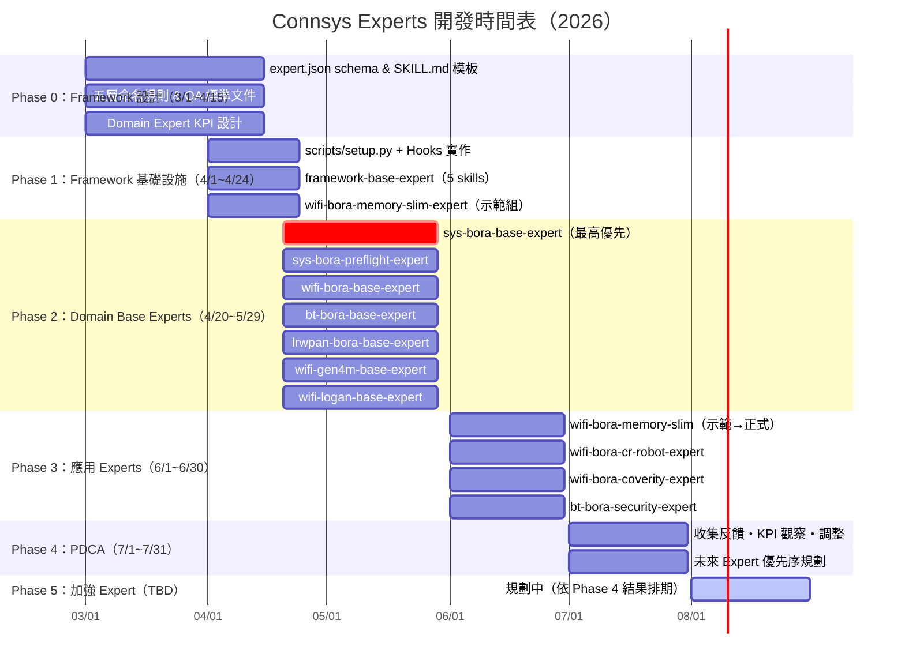

# Connsys Experts — 開發角色與任務分工

**文件版本**：v1.2
**日期**：2026-03-27
**狀態**：Draft
**目標讀者**：Project Lead、各 Domain Owner、Framework Engineer

> 本文件定義 `connsys-jarvis` 系統的開發角色、職責範圍、短期任務與長期任務。
> 短期 = Phase 0–2（3/1–5/29，基礎建設 + 第一批 Expert 上線）；長期 = Phase 3–5（6/1 起，擴充 + PDCA + 自我強化）。

---

## 1. 角色總覽

| 角色 | 人數 | 定位 | 主要產出 |
|------|------|------|---------|
| [Project Lead](#2-project-lead) | 1 | Schedule / Roadmap / Resource 協調 | 里程碑計畫、風險管理、跨 team 決策 |
| [Framework Engineer](#3-framework-engineer) | 1 | 基礎設施 Owner | scripts/setup.py、hooks、framework-base-expert |
| [WiFi Bora Domain Owner](#4-wifi-bora-domain-owner) | 1 | WiFi Expert 技術負責人 | wifi-*/experts 全部 skills |
| [BT Bora Domain Owner](#5-bt-bora-domain-owner) | 1 | BT Expert 技術負責人 | bt-*/experts 全部 skills |
| [Sys Bora Domain Owner](#6-sys-bora-domain-owner) | 1 | System Expert + 跨 domain 工具負責人 | sys-bora-base-expert（最高優先）|
| [QA / Skill Evaluator](#7-qa--skill-evaluator) | 1 | Skill 品質與評測 | test/report 標準、eval 報告 |

> **Domain Owner** 可自行撰寫 skill，也可協調 domain 內工程師分工撰寫，Owner 負最終品質責任。

---

## 2. Project Lead

### 職責定義

| 面向 | 職責 |
|------|------|
| **Schedule** | 制定並追蹤 Phase 0–4 里程碑 |
| **Roadmap** | 維護三階段願景（Human-Assisted → Semi-Autonomous → Multi-Agent）的演進計畫 |
| **Resource** | 評估各角色工作量，必要時協調工程師跨 domain 支援 |
| **決策** | cross-domain 介面衝突、schema 變更的最終拍板 |
| **對外** | 向管理層報告進度、風險與里程碑達成狀況 |

### 短期任務

| 優先 | 任務 | 產出 | 依賴 |
|------|------|------|------|
| P0 | 召集各 Domain Owner 確認 `expert.json` schema 與命名規則 | 已確認的 schema 文件 | — |
| P0 | 建立 Phase 0–2 詳細時間表（含 dependency 標示） | Sprint 計畫表 | — |
| P0 | 確認 `connsys-memory` remote repo 的 git 權限開通 | Repo 可寫入 | Sys Bora Domain Owner |
| P1 | 追蹤 Framework Engineer 的 Phase 1 進度（其他人的 blocker 來源）| 週會 status | — |
| P1 | 確認 `sys-bora-base-expert` 先於 wifi/bt 完成（關鍵 dependency）| 時程對齊 | Sys Bora Domain Owner |
| P2 | 協調各 Domain Owner 撰寫第一批 skill 的分工認領 | 任務清單 | Framework Eng |

### 長期任務

| 任務 | 目標 | 說明 |
|------|------|------|
| Phase 3 roadmap 更新 | 規劃 Stage 2 Semi-Autonomous 演進 | 哪些 expert 可先跑 automation？ |
| Resource 評估 | 判斷是否需要增加 domain 工程師 | 依 connsys-memory token 用量分析 |
| 跨 domain skill 升格流程 | 建立 domain → framework 的審核機制 | 需 QA 配合 |
| OpenClaw 遷移計畫 | Phase 2 hooks TypeScript 重寫的資源估算 | 依 Phase 1 完成度評估 |
| 指標追蹤 | 定期查看哪些 Expert 最常用、哪些 flow 最常卡關 | 來源：connsys-memory 分析 |

---

## 3. Framework Engineer

### 職責定義

| 面向 | 職責 |
|------|------|
| **基礎設施** | scripts/setup.py / setup-claude.sh / hooks 全部由此角色擁有 |
| **Framework 知識層** | framework-base-expert 的所有 skill / hook / command |
| **標準制定** | expert.json schema、SKILL.md 模板、命名規則（與 Project Lead 共同定稿）|
| **技術支援** | 各 Domain Owner 安裝或 hook 問題的第一線支援 |

### 短期任務

| 優先 | 任務 | 產出 | 備註 |
|------|------|------|------|
| P0 | `expert.json` schema 定稿 | `schema/expert.schema.json` | 所有 domain 的基礎 |
| P0 | `SKILL.md` 模板定稿 | `templates/SKILL.template.md` | QA 標準的起點 |
| P0 | 五層命名規則文件 | `docs/naming-rules.md` | Domain Owner 開工前必讀 |
| P0 | `connsys-memory` repo 目錄結構建立 | `employees/{id}/sessions\|handoffs\|summary.md` | Sys Bora Domain Owner 配合開權限 |
| P1 | `scripts/setup.py` 實作（symlink/uninstall/switch/env-only）| `scripts/setup.py` | Domain Owner 的安裝入口 |
| P1 | `setup-claude.sh` 實作（寫入 settings.json）| `setup-claude.sh` | 分離於 scripts/setup.py（setup.py 不修改 settings.json）|
| P1 | Hooks 實作（Shell 優先）| `session-start.sh` / `session-end.sh` / `pre-compact.sh` / `mid-session-checkpoint.sh` / `shared-utils.sh` | |
| P1 | Python helper 實作 | `memory-helper.py`（YAML 解析、token 計算）| Shell hooks 呼叫 |
| P1 | `framework-base-expert` 核心 skills | `framework-handoff-flow` / `framework-expert-discovery-knowhow` / `framework-memory-tool` | |
| P1 | `framework-skill-create-flow` skill | 互動式引導建立符合規範的 Skill（SKILL.md + README.md + test-basic.sh）| SKILL.md 模板定稿 |
| P1 | `framework-expert-create-flow` skill | 互動式引導建立符合規範的 Expert（soul/rules/duties/expert.md + expert.json + 資料夾骨架）| expert.json schema 定稿 |
| P1 | `registry.json` 初版 | 列出所有 expert + metadata | Domain Owner 開始後持續更新 |
| P2 | `.connsys-jarvis/memory/` 三區結構初始化邏輯 | `scripts/setup.py --init` 首次執行時建立 `shared/working/handoffs/` | |

### 長期任務

| 任務 | 目標 | 說明 |
|------|------|------|
| `framework-skill-create-expert` | 降低新增 skill 的門檻，可用 AI 輔助建立 SKILL.md | Phase 3 |
| `framework-learn-expert` | 分析 connsys-memory 自動萃取 pattern，產生 PR | Phase 4 |
| Hook 效能監控 | 追蹤 session-start/end 的執行時間，避免 hook 過重 | — |
| OpenClaw 遷移 | hooks TypeScript 重寫（Phase 2 遷移路線）| 依 Project Lead 時間表 |
| Security hooks | `pre-install-check.sh` 掃描 external-expert | Phase 4 |

---

## 4. WiFi Bora Domain Owner

### 職責定義

| 面向 | 職責 |
|------|------|
| **Domain 知識** | 決定哪些 WiFi 知識值得寫成 skill、哪個 type（flow/knowhow/tool）|
| **品質把關** | 審核 wifi domain 所有 PR（自己或協調工程師撰寫）|
| **跨 domain 協作** | 確認 sys-bora-base-expert 的工具（gerrit/repo）已滿足 WiFi 需求 |
| **依賴宣告** | 維護 wifi-*/expert.json 的 `dependencies` 欄位正確 |

### 短期任務

| 優先 | 任務 | 產出 | 依賴 |
|------|------|------|------|
| P1 | `wifi-bora-base-expert` skills | `wifi-bora-protocol-knowhow` / `wifi-bora-arch-knowhow` / `wifi-bora-coderule-knowhow` | Framework P0 完成 |
| P1 | `wifi-bora-build-expert` 核心 skills | `wifi-bora-build-flow` / `wifi-bora-builderror-knowhow` / `wifi-bora-linkerscript-knowhow` / `wifi-bora-rompatch-knowhow` | sys-bora-base-expert 完成 |
| P1 | `wifi-bora-build-expert/expert.json` | 含正確的 sys-bora-base-expert dependency | — |
| P2 | `wifi-gen4m-build-flow` | gen4m driver build 流程 SOP | — |
| P2 | `wifi-bora-debug-expert` skills | `wifi-bora-coredump-knowhow` / `wifi-bora-symbolmap-knowhow` / `wifi-bora-memory-knowhow` / `wifi-bora-uart-tool` / `wifi-bora-adbshell-tool` | — |
| P2 | 協調工程師撰寫 `wifi-bora-cicd-expert` skills | `wifi-bora-cicd-flow` / `wifi-bora-autotest-tool` | — |

### 長期任務

| 任務 | 目標 | 說明 |
|------|------|------|
| Skill 定期 review | 確保 SKILL.md 內容不過時 | 每季或每次 FW 大版本更新後 |
| `wifi-bora-build-expert` transitions 驗證 | 確認 BUILD_SUCCESS → wifi-bora-cicd-expert 流程順暢 | Stage 2 Semi-Autonomous 的先行條件 |
| 新 skill 評估 | 從 connsys-memory 的失敗記錄找出哪些知識缺口需補 SKILL.md | 與 QA 協作 |
| 培養 WiFi 工程師撰寫 skill 的能力 | domain 知識不能只靠 owner 一人 | 配合 framework-skill-create-expert |

---

## 5. BT Bora Domain Owner

### 職責定義

| 面向 | 職責 |
|------|------|
| **Domain 知識** | 決定 BT 知識的 skill 結構與優先順序 |
| **品質把關** | 審核 bt domain 所有 PR |
| **跨 domain 協作** | 確認 sys-bora-base-expert 工具滿足 BT 需求（gerrit/repo 操作）|
| **依賴宣告** | 維護 bt-*/expert.json 的 `dependencies` 欄位 |

### 短期任務

| 優先 | 任務 | 產出 | 依賴 |
|------|------|------|------|
| P1 | `bt-bora-base-expert` skills | `bt-bora-protocol-knowhow` / `bt-bora-arch-knowhow` / `bt-bora-coderule-knowhow` | Framework P0 完成 |
| P1 | `bt-bora-build-expert` skills | `bt-bora-build-flow` / `bt-bora-fw-build-flow` | sys-bora-base-expert 完成 |
| P1 | `bt-bora-build-expert/expert.json` | 含 sys-bora-base-expert dependency | — |
| P2 | `bt-bora-debug-expert` skills 規劃 | 與 BT 工程師討論哪些 debug 知識優先 | — |
| P2 | 協調工程師撰寫 `bt-bora-debug-expert` skills | 視 BT team 能量決定範圍 | — |

### 長期任務

| 任務 | 目標 | 說明 |
|------|------|------|
| BT coredump skill 補充 | `bt-bora-coredump-knowhow`（已移除，後續補回）| 待 BT team 確認需求 |
| Skill 定期 review | 確保 SKILL.md 不過時 | 每季 |
| `bt-bora-build-expert` transitions 設計 | BUILD_SUCCESS 後接哪個 expert？ | 與 Project Lead 討論 |
| 培養 BT 工程師撰寫 skill 的能力 | — | 同 WiFi |

---

## 6. Sys Bora Domain Owner

### 職責定義

| 面向 | 職責 |
|------|------|
| **最高優先** | `sys-bora-base-expert` 是 WiFi 和 BT 的共同依賴，**必須最先完成** |
| **跨 domain 工具** | gerrit / repo / preflight / device 等工具由此角色統一維護 |
| **Infra 協作** | `connsys-memory` remote 權限管理、CI/CD pipeline 設計 |
| **品質把關** | 審核 system domain 所有 PR |

### 短期任務

| 優先 | 任務 | 產出 | 依賴 | 備註 |
|------|------|------|------|------|
| **P0 最高** | `sys-bora-base-expert` skills — 跨 domain 工具 | `sys-bora-gerrit-tool` / `sys-bora-repo-tool` / `sys-bora-preflight-tool` / `sys-bora-device-tool` | Framework P0 | WiFi/BT 等待此完成才能開工 |
| P0 | `connsys-memory` remote repo 建立（配合 Project Lead）| git remote 可寫入 | — | — |
| P1 | `sys-bora-core-tracer-gdb-tool` | CoreTracer/GDB 操作 SOP | — | — |
| P1 | `sys-bora-base-expert/expert.json` | 描述檔（is_common=true）| — | — |
| P2 | `sys-bora-cicd-expert` 規劃 | `system-cicd-tool` | — | — |
| P2 | `sys-bora-device-expert` 規劃 | 裝置控制相關 skills | — | — |
| P2 | CI/CD pipeline 設計 | 自動執行 `test/`，產出 `report/` | QA 配合 | — |

### 長期任務

| 任務 | 目標 | 說明 |
|------|------|------|
| `connsys-memory` 使用量監控 | 追蹤各員工的 push 狀況，確保資料收集正常 | — |
| 工具版本管理 | gerrit/repo 工具升版時同步更新 SKILL.md | — |
| CI 自動測試整合 | test/ 下的腳本納入 CI，失敗時通知 Domain Owner | 與 QA 協作 |
| Stage 2 Infra | 支援 Semi-Autonomous 所需的自動化 infra（如 webhook 觸發 setup.py --init）| Phase 3 |

---

## 7. QA / Skill Evaluator

### 職責定義

| 面向 | 職責 |
|------|------|
| **標準制定** | `test/` 格式、`report/` 格式、skill 品質評分標準 |
| **日常審核** | 審核各 domain 提交的 skill PR 的 test/report 完整性 |
| **評測執行** | 定期執行 `test/`，彙整 `eval-report.md` |
| **數據分析** | token 用量趨勢、常見失敗模式，輸出給 Project Lead 決策 |

### 短期任務

| 優先 | 任務 | 產出 | 依賴 |
|------|------|------|------|
| P0 | `test/` 標準文件 | 測試腳本格式規範、命名規則、覆蓋率要求 | Framework P0 |
| P0 | `report/` 標準文件 | `execution-report.md` 格式、`test-report.md` 格式、token 記錄欄位 | Framework P0 |
| P0 | Skill 品質評分標準 | checklist：SKILL.md 必填欄位、描述清晰度、有無測試 | — |
| P1 | 協助 Framework Eng 建立 `framework-skill-create-expert` 的評測面向 | eval 指標清單 | Framework P1 |
| P2 | 審核第一批 domain skills 的 test/report | PR review comments | 各 Domain P2 |
| P2 | 執行第一次全系統 eval，產出基準報告 | `baseline-eval-report.md` | 所有 P2 完成 |

### 長期任務

| 任務 | 目標 | 說明 |
|------|------|------|
| token 用量趨勢分析 | 找出「貴但不必要」的 skill，建議優化 | 來源：report/ |
| Skill 退化偵測 | FW 改版後哪些 SKILL.md 內容失效 | 定期 review cycle |
| `framework-learn-expert` 輸入準備 | 整理 connsys-memory 的失敗記錄，作為自動學習的訓練資料 | Phase 4 |
| 評測自動化 | CI 自動跑 test/，結果自動寫入 report/ | 與 Sys Bora Domain Owner 協作 |
| Skill 升格標準 | 制定 domain skill → framework skill 的量化門檻 | 與 Project Lead 協作 |

---

## 8. 決策權責（RACI）

| 決策事項 | 負責執行（R） | 最終拍板（A） | 諮詢（C） |
|---------|------------|------------|---------|
| `expert.json` schema 變更 | Framework Eng | Project Lead | 所有 Domain Owner |
| 新增 framework-level skill | Framework Eng | Project Lead | 所有 Domain Owner 投票 |
| skill 從 domain 升格 framework | 提案 Domain Owner | Project Lead | 所有 Domain Owner + QA |
| domain 內新增/修改 skill | Domain Owner | Domain Owner | QA |
| 里程碑時間調整 | Project Lead | Project Lead | 相關 Domain Owner |
| `connsys-memory` 結構變更 | Framework Eng | Project Lead | Sys Bora Domain Owner |
| CI 測試設計 | Sys Bora Domain Owner + QA | Sys Bora Domain Owner | Framework Eng |
| hooks 重大改版 | Framework Eng | Project Lead | 所有人 |

---

## 9. 交付里程碑與時間表

### 9.1 總覽時間表

#### ASCII 甘特圖

```
Connsys Experts 開發時間表（2026）

         MAR               APR               MAY               JUN               JUL
         W1  W2  W3  W4    W1  W2  W3  W4    W1  W2  W3  W4    W1  W2  W3  W4    W1  W2  W3  W4
         3/1          3/28 4/1          4/28 5/1          5/28 6/1          6/28 7/1          7/28
         ──────────────────────────────────────────────────────────────────────────────────────────
Phase 0  [══════════════════════════════════]
(3/1~4/15) Framework 設計 & Domain Expert KPI

Phase 1                     [══════════════]
(4/1~4/24)                  Framework 基礎設施實作 + 測試（含 memory-slim 示範組）

Phase 2                               [═════════════════════]
(4/20~5/29)                           Domain Base Experts 設計・實作・測試

Phase 3                                                       [═════════════════════]
(6/1~6/30)                                                    應用 Experts 設計・實作・測試

Phase 4                                                                             [═════════════]
(7/1~7/31)                                                                          PDCA・KPI・未來規劃

Phase 5  TBD ───────────────────────────── 依 Phase 4 KPI 結果排期 ────────────────────────────────
         ──────────────────────────────────────────────────────────────────────────────────────────
         ▲ P0/P1 重疊（4/1~4/15）：Framework 設計定稿同時，基礎設施開始實作
         ▲ P1/P2 重疊（4/20~4/24）：Framework 收尾，Domain 開始進場
```

#### Mermaid 甘特圖



---

### 9.2 各 Phase 詳細交付項目

### Phase 0（3/1–4/15）：地基（所有人開工前必須完成）

| # | 任務 | Owner | 產出 |
|---|------|-------|------|
| 0-1 | `expert.json` schema 定稿 | Framework Eng | `schema/expert.schema.json` |
| 0-2 | `SKILL.md` 模板定稿 | Framework Eng | `templates/SKILL.template.md` |
| 0-3 | `test/` / `report/` 標準文件 | QA | `docs/skill-quality-standard.md` |
| 0-4 | 五層命名規則文件 | Framework Eng | `docs/naming-rules.md` |
| 0-5 | `connsys-memory` remote repo 建立 | Sys Bora Domain Owner | git remote 可寫入 |
| 0-6 | Phase 1–2 詳細時間表 | Project Lead | Sprint 計畫表 |

### Phase 1（4/1–4/24）：Framework 基礎設施（其他人的 blocker）

| # | 任務 | Owner | 產出 |
|---|------|-------|------|
| 1-1 | `scripts/setup.py` | Framework Eng | 支援 symlink/switch/uninstall |
| 1-2 | `setup-claude.sh` | Framework Eng | 寫入 settings.json |
| 1-3 | Hooks（session-start/end/pre-compact/mid-checkpoint）| Framework Eng | `.sh` + `memory-helper.py` |
| 1-4 | `framework-base-expert` | Framework Eng | handoff-flow / discovery / memory-tool |
| 1-5 | `registry.json` 初版 | Framework Eng | 所有 expert 目錄 |

### Phase 2（4/20–5/29）：Domain 層（平行進行，sys-bora-base 最先）

| # | 任務 | Owner | 產出 | 前置 |
|---|------|-------|------|------|
| 2-1 | `sys-bora-base-expert`（**最高優先**）| Sys Bora Domain Owner | sys-bora-gerrit-tool / sys-bora-repo-tool / sys-bora-preflight-tool / sys-bora-device-tool | Phase 1 |
| 2-2 | `wifi-bora-base-expert` | WiFi Bora Domain Owner | wifi-bora-protocol-knowhow / wifi-bora-arch-knowhow / wifi-bora-coderule-knowhow | 2-1 |
| 2-3 | `bt-bora-base-expert` | BT Bora Domain Owner | bt-bora-protocol-knowhow / bt-bora-arch-knowhow / bt-bora-coderule-knowhow | 2-1 |
| 2-4 | `wifi-bora-build-expert` | WiFi Bora Domain Owner | wifi-bora-build-flow / wifi-bora-builderror-knowhow / wifi-bora-linkerscript-knowhow | 2-2 |
| 2-5 | `bt-bora-build-expert` | BT Bora Domain Owner | bt-bora-build-flow / bt-bora-fw-build-flow | 2-3 |
| 2-6 | 第一次全系統 eval | QA | baseline-eval-report.md | 2-4, 2-5 |

### Phase 3（6/1–6/30）：擴充 Expert 陣容（應用 Experts）

| # | 任務 | Owner | 產出 |
|---|------|-------|------|
| 3-1 | `wifi-bora-debug-expert` | WiFi Bora Domain Owner | wifi-bora-coredump-knowhow / wifi-bora-symbolmap-knowhow / wifi-bora-uart-tool |
| 3-2 | `wifi-bora-cicd-expert` | WiFi Bora Domain Owner | wifi-bora-cicd-flow / wifi-bora-autotest-tool |
| 3-3 | `bt-bora-debug-expert` | BT Bora Domain Owner | 待規劃 |
| 3-4 | `sys-bora-cicd-expert` | Sys Bora Domain Owner | sys-bora-cicd-tool |
| 3-5 | `sys-bora-device-expert` | Sys Bora Domain Owner | sys-bora-device-tool |
| 3-6 | CI 自動測試整合 | Sys Bora Domain Owner + QA | test/ 納入 CI pipeline |

### Phase 4（7/1–7/31）：PDCA（收集反饋・KPI 觀察・未來規劃）

| # | 任務 | Owner | 產出 |
|---|------|-------|------|
| 4-1 | 收集工程師反饋，評估 Expert 實用性 | Project Lead + 各 Domain Owner | 反饋報告 |
| 4-2 | KPI 量測：Hand-off 完整性、Expert 推薦準確率、token 用量趨勢 | QA | KPI 儀表板 |
| 4-3 | 調整優先序：決定哪些 Expert 需強化，哪些可降優先 | Project Lead | 更新後 Roadmap |
| 4-4 | `framework-learn-expert` 初步設計 | Framework Eng | 分析 connsys-memory → 產生 skill PR |
| 4-5 | 規劃 Phase 5 範圍與資源 | Project Lead | Phase 5 計畫書 |

### Phase 5（TBD）：加強 Expert（Expert 總覽表未涵蓋的 Expert）

> Phase 5 的排期與範圍將依 Phase 4 的 KPI 結果和工程師反饋決定。以下為**候選清單**，尚未確定優先序。

#### 框架層（Framework）強化 Expert

| 候選 Expert | 說明 |
|------------|------|
| `framework-learn-expert` | 分析 `connsys-memory` 自動萃取 pattern，產生 skill PR（AI 自我強化）|
| `framework-security-expert` | `pre-install-check.sh` 掃描 external-expert 安全性 |

#### WiFi Bora 應用強化 Expert

| 候選 Expert | 說明 |
|------------|------|
| `wifi-bora-debug-expert` | WiFi coredump 分析、symbol map 解讀、UART/ADB 工具整合 |
| `wifi-bora-cicd-expert` | WiFi CI/CD 自動測試流程、autotest 工具 |
| `wifi-bora-coverity-expert` | Coverity 靜態分析 + CR report 生成（已在 Phase 3，Phase 5 強化）|

#### BT Bora 強化 Expert

| 候選 Expert | 說明 |
|------------|------|
| `bt-bora-debug-expert` | BT coredump 分析與 debug SOP |
| `bt-bora-build-expert` | BT firmware build 完整流程（含 fw-build-flow）|

#### Sys Bora 強化 Expert

| 候選 Expert | 說明 |
|------------|------|
| `sys-bora-cicd-expert` | 系統層 CI/CD pipeline 自動化工具 |
| `sys-bora-device-expert` | 裝置控制（flash/reboot/串口）相關 skills |

#### 新 Domain Expert（待規劃）

| 候選 Expert | 說明 |
|------------|------|
| `lrwpan-bora-*-expert` | LR-WPAN 應用 Expert（協定分析、debug、CI 等，待 Domain Owner 規劃）|
| `wifi-gen4m-*-expert` | WiFi Gen4M 應用 Expert（build、debug、CI 等，待 Domain Owner 規劃）|
| `wifi-logan-*-expert` | WiFi Logan 應用 Expert（build、debug、CI 等，待 Domain Owner 規劃）|

---

## 10. Resource 分配總覽（WBS）

> 本表為與各主管討論 resource 安排之用。依角色分組列出 **Phase 0–3 所有必要任務**，Phase 4 為成熟後選項不列入。
> **優先說明**：P0 = 全員 blocker，P1 = 本角色核心，P2 = Phase 2 主要交付，P3 = 擴充階段。

### Framework Engineer

| ID | Phase | 優先 | 任務 | 交付物 | 前置依賴 |
|----|-------|------|------|--------|---------|
| F-01 | 0 | P0 | `expert.json` schema 定稿 | `schema/expert.schema.json` | — |
| F-02 | 0 | P0 | `SKILL.md` 模板定稿 | `templates/SKILL.template.md` | — |
| F-03 | 0 | P0 | 五層命名規則文件 | `docs/naming-rules.md` | — |
| F-04 | 0 | P0 | `connsys-memory` repo 目錄結構設計 | `employees/{id}/sessions\|handoffs\|summary.md` | S-01 |
| F-05 | 1 | P1 | `scripts/setup.py` 實作（--init/--add/--remove/--uninstall/--doctor/--list）| `connsys-jarvis/scripts/setup.py` | F-01 |
| F-06 | 1 | P1 | `setup-claude.sh` 實作（寫入 settings.json，分離於 setup.py）| `setup-claude.sh` | F-05 |
| F-07 | 1 | P1 | Hooks 實作（Shell 優先）| `session-start.sh / session-end.sh / pre-compact.sh / mid-session-checkpoint.sh / shared-utils.sh` | — |
| F-08 | 1 | P1 | Python memory helper | `memory-helper.py`（YAML 解析、token 計算，Shell hooks 呼叫）| F-07 |
| F-09 | 1 | P1 | `framework-base-expert` 核心 skills | `framework-handoff-flow / framework-expert-discovery-knowhow / framework-memory-tool` | F-01, F-07 |
| F-10 | 1 | P1 | `registry.json` 初版 | 所有 expert 目錄 + metadata | — |
| F-11 | 2 | P2 | `.connsys-jarvis/memory/` 三區初始化邏輯 | `shared/ working/ handoffs/` 由 `--init` 自動建立 | F-05 |
| F-13 | 1 | P1 | `framework-skill-create-flow` skill | 互動式引導建立符合規範的 Skill（SKILL.md + README.md + test-basic.sh 初版）| F-02（SKILL.md 模板）|
| F-14 | 1 | P1 | `framework-expert-create-flow` skill | 互動式引導建立符合規範的 Expert（soul/rules/duties/expert.md + expert.json + 資料夾骨架）| F-01（expert.json schema）|
| F-12 | 3 | P3 | `framework-learn-expert` | 分析 connsys-memory → 自動產生 skill PR | Phase 2 完成 |

**所需人力**：1 名 Framework Engineer（Phase 0–1 全力投入，Phase 2 起轉技術支援）

---

### Sys Bora Domain Owner

| ID | Phase | 優先 | 任務 | 交付物 | 前置依賴 |
|----|-------|------|------|--------|---------|
| S-01 | 0 | P0 | `connsys-memory` remote repo 建立與權限開通 | git remote 可寫入 | — |
| S-02 | 2 | **P0最高** | `sys-bora-base-expert` skills（WiFi / BT 共同 blocker）| `sys-bora-gerrit-tool / sys-bora-repo-tool / sys-bora-preflight-tool / sys-bora-device-tool` | Phase 1 |
| S-03 | 2 | P2 | `sys-bora-preflight-expert`（preflight 流程 SOP）| `sys-bora-preflight-flow / sys-bora-gerrit-commit-flow` | S-02 |
| S-04 | 2 | P2 | `sys-bora-core-tracer-gdb-tool` skill | CoreTracer/GDB 操作 SOP | S-02 |
| S-05 | 2 | P2 | `sys-bora-base-expert/expert.json` | 描述檔（is_base=true）| S-02 |
| S-06 | 2 | P2 | CI/CD pipeline 設計 | 自動執行 `test/` + 產出 `report/` | QA 配合 |
| S-07 | 3 | P3 | `sys-bora-cicd-expert` | `sys-bora-cicd-tool` | S-03 |
| S-08 | 3 | P3 | `sys-bora-device-expert` | `sys-bora-device-tool` | S-02 |

**所需人力**：1 名 Sys Bora Domain Owner（S-02 是 WiFi / BT 開工的前置條件，**最高優先**）

---

### WiFi Bora Domain Owner

| ID | Phase | 優先 | 任務 | 交付物 | 前置依賴 |
|----|-------|------|------|--------|---------|
| W-01 | 2 | P1 | `wifi-bora-base-expert` skills（domain 共用）| `wifi-bora-protocol-knowhow / wifi-bora-arch-knowhow / wifi-bora-coderule-knowhow / wifi-bora-build-flow / wifi-bora-linkerscript-knowhow / wifi-bora-symbolmap-knowhow / wifi-bora-memory-knowhow` | S-02 |
| W-02 | 2 | P1 | `wifi-bora-base-expert/expert.json` | 含正確 dependencies（framework / sys-bora）| W-01 |
| W-03 | 2 | P2 | `wifi-bora-build-expert` skills | `wifi-bora-build-flow / wifi-bora-builderror-knowhow / wifi-bora-rompatch-knowhow` | W-01 |
| W-04 | 2 | P2 | `wifi-bora-memory-slim-expert`（精簡版，低 context）| `wifi-bora-memslim-flow / wifi-bora-ast-tool / wifi-bora-lsp-tool` | W-01 |
| W-05 | 2 | P2 | `wifi-gen4m-build-flow` skill（gen4m driver build SOP）| wifi-gen4m-build-flow | W-03 |
| W-06 | 3 | P3 | `wifi-bora-debug-expert` skills | `wifi-bora-coredump-knowhow / wifi-bora-symbolmap-knowhow / wifi-bora-uart-tool / wifi-bora-adbshell-tool` | W-01 |
| W-07 | 3 | P3 | `wifi-bora-cicd-expert` | `wifi-bora-cicd-flow / wifi-bora-autotest-tool` | W-03 |

**所需人力**：1 名 WiFi Bora Domain Owner（可協調 domain 內工程師分工撰寫 skill，Owner 負品質）

---

### BT Bora Domain Owner

| ID | Phase | 優先 | 任務 | 交付物 | 前置依賴 |
|----|-------|------|------|--------|---------|
| B-01 | 2 | P1 | `bt-bora-base-expert` skills（domain 共用）| `bt-bora-protocol-knowhow / bt-bora-arch-knowhow / bt-bora-coderule-knowhow` | S-02 |
| B-02 | 2 | P1 | `bt-bora-base-expert/expert.json` | 含正確 dependencies | B-01 |
| B-03 | 2 | P2 | `bt-bora-build-expert` skills | `bt-bora-build-flow / bt-bora-fw-build-flow` | B-01 |
| B-04 | 3 | P3 | `bt-bora-debug-expert` skills 規劃 | 與 BT 工程師討論範圍（bt-bora-coredump-knowhow 等）| B-01 |

**所需人力**：1 名 BT Bora Domain Owner（範圍較 WiFi 小，可兼任其他工作）

---

### QA / Skill Evaluator

| ID | Phase | 優先 | 任務 | 交付物 | 前置依賴 |
|----|-------|------|------|--------|---------|
| Q-01 | 0 | P0 | `test/` 腳本格式標準 | 命名規則、覆蓋率要求文件 | F-01 |
| Q-02 | 0 | P0 | `report/` 格式標準 | `execution-report.md` + token 欄位規範 | F-01 |
| Q-03 | 0 | P0 | Skill 品質評分 checklist | SKILL.md 必填欄位、描述清晰度、測試覆蓋 | — |
| Q-04 | 2 | P2 | 審核第一批 domain skills 的 test/report | PR review comments | W-01, B-01, S-02 |
| Q-05 | 2 | P2 | 第一次全系統 eval | `baseline-eval-report.md` | W-03, B-03 |
| Q-06 | 2 | P2 | CI 測試整合（配合 Sys Bora）| test/ 腳本自動化執行 | S-06 |

**所需人力**：1 名 QA（Phase 0 標準制定、Phase 2 起密集審核與 eval）

---

### Project Lead

| ID | Phase | 優先 | 任務 | 交付物 | 前置依賴 |
|----|-------|------|------|--------|---------|
| L-01 | 0 | P0 | 召集各 Domain Owner 確認 schema 與命名規則 | 已確認的 schema 文件 | — |
| L-02 | 0 | P0 | Phase 0–2 詳細時間表（含 dependency 標示）| Sprint 計畫表 | — |
| L-03 | 0 | P0 | 確認 `connsys-memory` remote repo 權限開通 | Repo 可寫入 | S-01 |
| L-04 | 1 | P1 | 追蹤 Framework Eng Phase 1 進度（所有人的 blocker 來源）| 週會 status | — |
| L-05 | 1 | P1 | 確認 `sys-bora-base-expert` 先於 WiFi/BT 完成 | 時程對齊 | S-02 |
| L-06 | 2 | P2 | 協調各 Domain Owner 第一批 skill 分工認領 | 任務清單 | Phase 1 |

**所需人力**：1 名 Project Lead（兼任可接受，主要工作在 Phase 0 啟動與 Phase 1 追蹤）

---

### 跨角色關鍵依賴圖

```
Phase 0                Phase 1               Phase 2                  Phase 3
───────────────────────────────────────────────────────────────────────────────
[F] schema/模板定稿 ──→ [F] setup.py + hooks ──→
[S] connsys-memory ──→  [F] framework-base  ──→ [S] sys-bora-base ──→ [W] wifi-debug
                                                      ↓                 [B] bt-debug
                                              [W] wifi-bora-base        [S] sys-cicd
                                              [B] bt-bora-base
[Q] 品質標準制定 ──────────────────────────→  [Q] eval + 審核
```

> **關鍵路徑**：`expert.json schema` → `scripts/setup.py` → `sys-bora-base-expert` → `wifi/bt-bora-base-expert`
> 任何一個節點延遲，後續所有 domain 開工都會受阻。

## 11. 工作協作節奏

| 會議 | 頻率 | 主持 | 參與者 | 目的 |
|------|------|------|--------|------|
| Sprint Planning | 每兩週 | Project Lead | 全員 | 認領任務、確認 dependency |
| 技術同步 | 每週 | Framework Eng | 全員 | Framework 進度、各人 blocker |
| Domain Sync | 視需要 | Domain Owner | 相關 domain | domain 內 skill 細節 |
| Eval Review | 每月 | QA | Project Lead + 各 Owner | token 趨勢、失敗分析 |
| PR Review | 即時 | 各 Owner | 依決策表 | 確保品質 |

---

## 11. 名詞定義

| 術語 | 定義 |
|------|------|
| Domain Owner | 負責一個 domain 的所有 Expert 品質，可委派 domain 工程師協助撰寫 |
| Phase 0–4 | 依交付複雜度排序的開發階段，0 為地基，4 為自我進化 |
| Skill 升格 | 將 domain-level skill 提升為 framework-level，需 Project Lead 拍板 |
| eval | 執行 `test/` 並產出 `report/`，驗證 skill 是否達到預期效果 |
| token 用量 | 一次 Expert session 消耗的 Claude API token 數，影響成本 |
