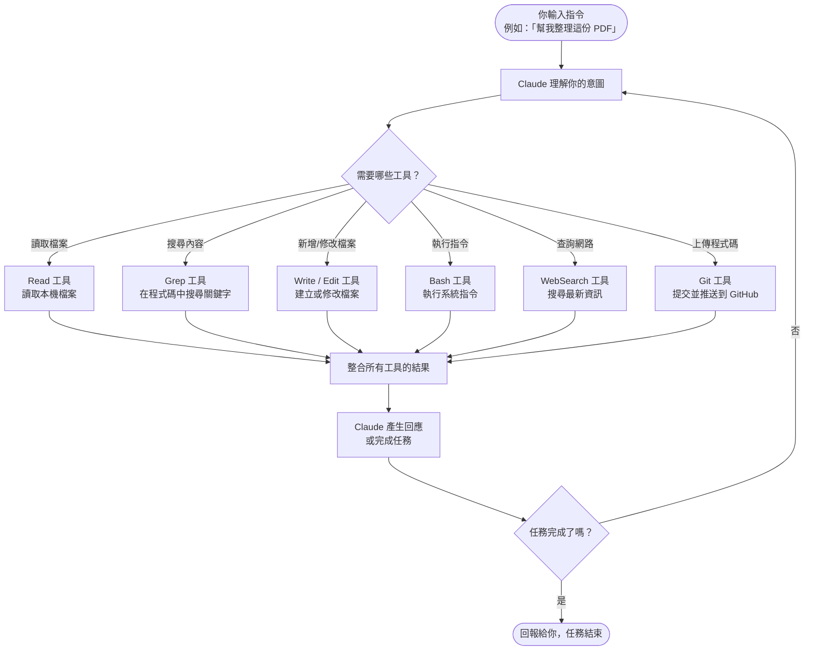
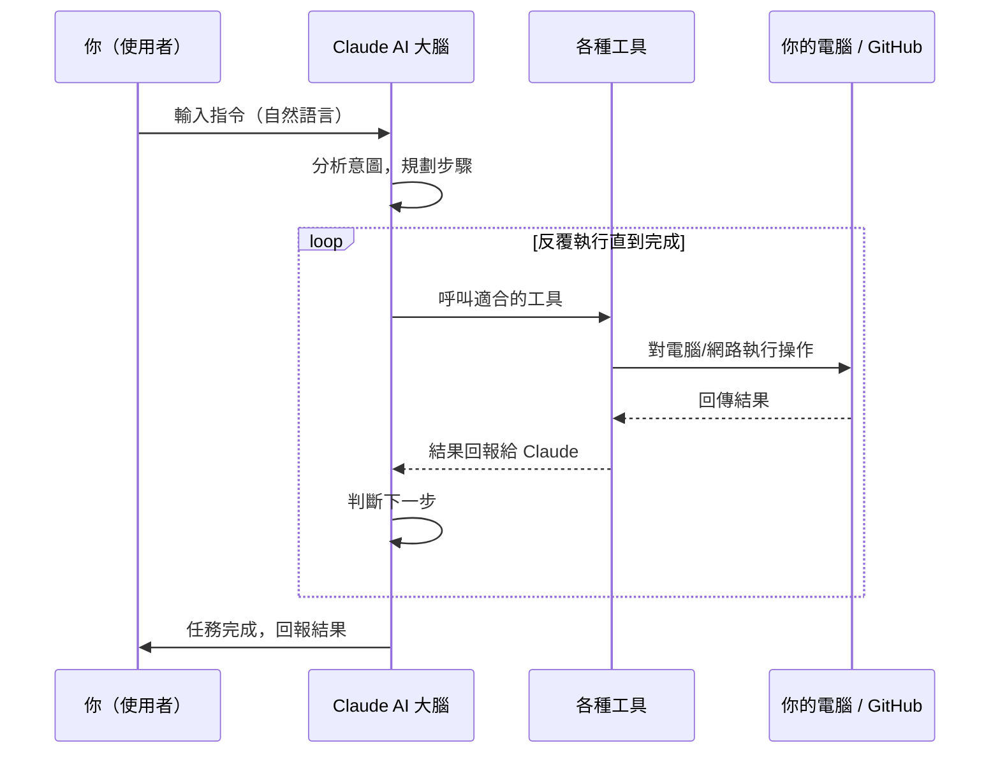
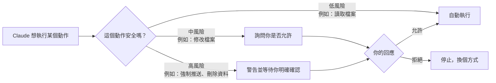

# Claude Code 運作原理

> 給不熟悉技術的朋友看的簡單說明

---

## 一句話解釋

**你用中文（或任何語言）說出你想做的事，Claude Code 幫你把想法變成真正可以執行的程式或文件。**

---

## 整體流程圖

---

## 各工具是做什麼的？

| 工具名稱 | 功能說明 | 生活化比喻 |
|----------|----------|------------|
| `Read` | 讀取你電腦上的檔案 | 像翻開一本書 |
| `Write` | 建立新的檔案 | 像拿出一張白紙寫字 |
| `Edit` | 修改已有的檔案 | 像用修正液改作業 |
| `Grep` | 在大量檔案中搜尋關鍵字 | 像用 Ctrl+F 全文搜尋 |
| `Glob` | 找出符合條件的檔案 | 像用篩子過濾檔案 |
| `Bash` | 執行系統指令（安裝軟體、跑測試等） | 像打開終端機輸入指令 |
| `WebSearch` | 搜尋網路上的最新資訊 | 像 Google 搜尋 |
| `Git` | 把程式碼存檔並上傳到 GitHub | 像把報告存檔並寄出去 |
| `Agent` | 派出子任務給專門的小助手 | 像主管把工作分派給專員 |
| `TodoWrite` | 記錄並管理待辦事項 | 像便利貼清單 |

---

## 更詳細的互動流程

---

## 安全機制

---

## 簡單比喻

把 Claude Code 想像成一位**超強的工程師助理**：

1. **你說話（自然語言）** → 他聽懂你的需求
2. **他去查資料、讀程式碼** → 了解現況
3. **他動手做修改** → 幫你完成工作
4. **他把成果交給你** → 報告結果
5. **危險動作會先問你** → 不會擅自做重大決定

---

*由 Claude Code 自動生成 | 2026-03-16*
